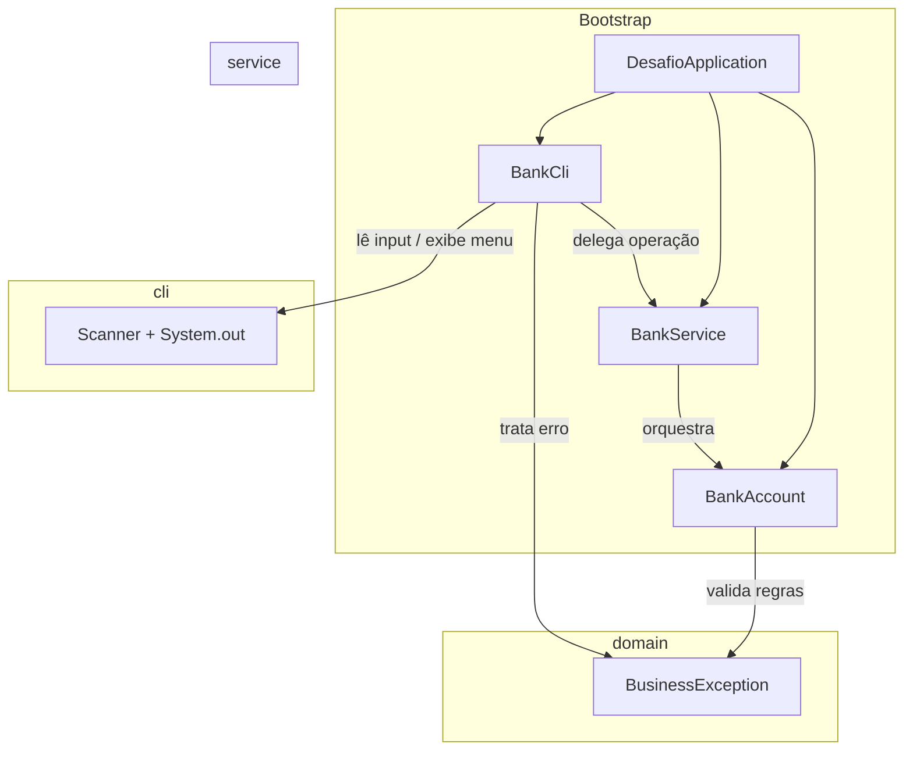

<div align="center">

# DesafioJava1

[](https://github.com/ESousa97/DesafioJava1/actions/workflows/ci.yml)
[](https://www.codefactor.io/repository/github/esousa97/desafiojava1)
[](https://opensource.org/licenses/MIT)
[](#)

**Sistema bancário CLI em Java com arquitetura em camadas — separação cli/domain/service/exception, entidade `BankAccount` com regras de saldo (depósito, transferência, validação de valor positivo, saldo insuficiente), `BusinessException` com código semântico, `BankCli` com menu interativo e tratamento de `InputMismatchException`, testes unitários JUnit 5 para regras críticas, formatação Spotless (google-java-format), lint Checkstyle, cobertura JaCoCo, CI com matrix JDK 17+21, Security Audit semanal com Trivy + Dependency Review, Maven Wrapper customizado e scripts PowerShell.**

</div>

---

> **⚠️ Projeto Arquivado**
> Este projeto não recebe mais atualizações ou correções. O código permanece disponível como referência e pode ser utilizado livremente sob a licença MIT. Fique à vontade para fazer fork caso deseje continuar o desenvolvimento.

---

<div align="center">


</div>

---

## Índice

- [Sobre o Projeto](#sobre-o-projeto)
- [Funcionalidades](#funcionalidades)
- [Tecnologias](#tecnologias)
- [Arquitetura](#arquitetura)
- [Estrutura do Projeto](#estrutura-do-projeto)
- [Começando](#começando)
  - [Pré-requisitos](#pré-requisitos)
  - [Instalação](#instalação)
  - [Uso](#uso)
- [Scripts Disponíveis](#scripts-disponíveis)
- [Testes](#testes)
- [Qualidade e Segurança](#qualidade-e-segurança)
- [FAQ](#faq)
- [Licença](#licença)
- [Contato](#contato)

---

## Sobre o Projeto

Sistema bancário de linha de comando que implementa operações essenciais — consulta de saldo, depósito e transferência — com arquitetura em camadas projetada para manutenção profissional e evolução incremental.

O repositório prioriza:

- **Arquitetura em camadas com separação de I/O** — `BankCli` (camada cli) gerencia menu interativo, leitura de input com `Scanner` e tratamento de `InputMismatchException`, delegando toda lógica para `BankService` (camada service), que orquestra operações sobre `BankAccount` (camada domain) — testes unitários funcionam sem dependência de I/O
- **Regras de negócio com exceções semânticas** — `BankAccount.deposit()` e `BankAccount.transfer()` validam valor positivo e saldo suficiente, lançando `BusinessException` com códigos tipados (`INVALID_DEPOSIT_AMOUNT`, `INVALID_TRANSFER_AMOUNT`, `INSUFFICIENT_FUNDS`) tratados na CLI com mensagem formatada
- **Composição de dependências no bootstrap** — `DesafioApplication.main()` instancia `BankAccount` → `BankService` → `BankCli` com injeção manual via construtor, sem frameworks, facilitando testes e substituição de componentes
- **Pipeline de qualidade em 3 camadas** — Spotless (google-java-format) para formatação automática, Checkstyle (11 regras: `NeedBraces`, `AvoidStarImport`, `FinalLocalVariable`, `OneStatementPerLine`, etc.) para lint, JaCoCo para cobertura — todos executados na fase `verify`
- **Segurança automatizada** — Workflow `security-audit.yml` com `dependency-review-action` em PRs e varredura semanal com Trivy (`CRITICAL`, `HIGH`) + SECURITY.md com política de disclosure
- **Maven Wrapper customizado** — `mvnw`/`mvnw.cmd` scripts que baixam e extraem Maven 3.9.9 automaticamente (sem dependência de `.mvn/wrapper/maven-wrapper.jar` padrão)

---

## Funcionalidades

- **Consultar saldo** — Exibe saldo atual formatado com `Locale.US` e 2 casas decimais
- **Depositar valor** — Valida valor positivo (`> 0`), soma ao saldo e exibe novo saldo; rejeita valores negativos ou zero com `BusinessException(INVALID_DEPOSIT_AMOUNT)`
- **Transferir valor** — Valida valor positivo e verifica saldo suficiente antes de debitar; rejeita com `INVALID_TRANSFER_AMOUNT` ou `INSUFFICIENT_FUNDS`
- **Menu interativo com loop** — Menu com dados do cliente (nome, tipo de conta, saldo) exibido a cada iteração, opção de sair encerra com mensagem de despedida, `ENTER` para continuar entre operações
- **Tratamento robusto de input** — `InputMismatchException` capturada tanto na leitura de opção do menu quanto na leitura de valores monetários, com mensagens de orientação e limpeza do buffer

---

## Tecnologias


**Dependências:** JDK 17+ (LTS), JUnit Jupiter 5.11.4 (test), Checkstyle 10.21.2, Spotless 2.43.0 (google-java-format), JaCoCo 0.8.12. Zero dependências de runtime.

---

## Arquitetura



### Camadas e Responsabilidades

| Camada | Classe | Responsabilidade |
| --- | --- | --- |
| **bootstrap** | `DesafioApplication` | Composição de dependências e entry point |
| **cli** | `BankCli` | Menu interativo, leitura de input, formatação de saída, tratamento de exceções |
| **service** | `BankService` | Fachada de casos de uso (deposit, transfer, consultas) |
| **domain** | `BankAccount` | Entidade com estado (saldo) e regras de negócio (validação de valor, saldo insuficiente) |
| **exception** | `BusinessException` | RuntimeException com código semântico (`INVALID_DEPOSIT_AMOUNT`, `INSUFFICIENT_FUNDS`, etc.) |

### Decisões de Design

| Decisão | Justificativa |
| --- | --- |
| CLI isolada da lógica de domínio | Testes unitários de `BankService`/`BankAccount` sem dependência de I/O |
| `BusinessException` com código semântico | CLI formata `Erro [CÓDIGO]: mensagem` sem acoplar a strings |
| Injeção manual via construtor | Sem frameworks; explícita, testável, zero overhead |
| Maven Wrapper customizado (sem JAR) | Scripts `mvnw`/`mvnw.cmd` baixam Maven sob demanda, evitando binário no repositório |

---

## Estrutura do Projeto

```
DesafioJava1/
├── src/
│   ├── main/java/io/github/esousa97/desafio/
│   │   ├── DesafioApplication.java             # Entry point — composição de dependências
│   │   ├── cli/
│   │   │   └── BankCli.java                    # Menu interativo, leitura de input, tratamento de erros
│   │   ├── domain/
│   │   │   └── BankAccount.java                # Entidade com saldo, depósito, transferência, validações
│   │   ├── exception/
│   │   │   └── BusinessException.java          # RuntimeException com código semântico
│   │   └── service/
│   │       └── BankService.java                # Fachada de casos de uso
│   └── test/java/io/github/esousa97/desafio/service/
│       └── BankServiceTest.java                # 4 testes — depósito, transferência, valores inválidos
├── imgs/
│   └── javademo.png                            # Screenshot da execução
├── docs/
│   ├── architecture.md                         # Documentação de arquitetura
│   ├── deployment.md                           # Build de release e execução do JAR
│   └── setup.md                                # Setup e validação local
├── scripts/
│   ├── run.ps1                                 # Atalho PowerShell para compilar e executar
│   └── validate.ps1                            # Atalho PowerShell para pipeline local completa
├── config/checkstyle/
│   └── checkstyle.xml                          # 11 regras (NeedBraces, AvoidStarImport, FinalLocalVariable, etc.)
├── .github/
│   ├── workflows/
│   │   ├── ci.yml                              # Build + Spotless + Checkstyle + Test + Verify (matrix JDK 17+21)
│   │   └── security-audit.yml                  # Dependency Review (PRs) + Trivy semanal (HIGH/CRITICAL)
│   ├── ISSUE_TEMPLATE/
│   │   ├── bug_report.yml                      # Template YAML com aviso de archived
│   │   ├── feature_request.yml
│   │   └── config.yml                          # Blank issues disabled + contact links
│   ├── PULL_REQUEST_TEMPLATE.md                # Checklist com validação local
│   ├── CODEOWNERS                              # @ESousa97
│   ├── FUNDING.yml                             # GitHub Sponsors
│   └── dependabot.yml                          # Maven + Actions (PRs desabilitados — archived)
├── mvnw                                        # Maven Wrapper POSIX (baixa Maven 3.9.9 sob demanda)
├── mvnw.cmd                                    # Maven Wrapper Windows
├── pom.xml                                     # JDK 17, JUnit 5.11.4, Checkstyle 10.21.2, Spotless 2.43.0, JaCoCo 0.8.12
├── Desafio.md                                  # Enunciado original do desafio
├── CHANGELOG.md                                # Keep a Changelog (v1.0.0 → v1.0.1)
├── CONTRIBUTING.md                             # Conventional Commits + setup + validação
├── CODE_OF_CONDUCT.md                          # Contributor Covenant 2.1
├── SECURITY.md                                 # Política de disclosure + SLA
├── .editorconfig                               # UTF-8, LF, indent 2
├── .gitattributes                              # LF normalizado
├── .env.example                                # APP_ENV, APP_LOCALE
└── LICENSE                                     # MIT
```

---

## Começando

### Pré-requisitos

```bash
java -version   # JDK 17 ou superior
```

Maven Wrapper incluído — não é necessário instalar Maven separadamente.

### Instalação

```bash
git clone https://github.com/ESousa97/DesafioJava1.git
cd DesafioJava1
```

### Uso

```bash
# Compilar e executar
./mvnw.cmd -q compile
java -cp target/classes io.github.esousa97.desafio.DesafioApplication
```

Ou via script PowerShell:

```bash
pwsh ./scripts/run.ps1
```

Via JAR:

```bash
./mvnw.cmd -B clean verify
java -cp target/desafio-java1-1.0.0.jar io.github.esousa97.desafio.DesafioApplication
```

---

## Scripts Disponíveis

```bash
# Compilar
./mvnw.cmd -B compile

# Testes unitários
./mvnw.cmd -B test

# Lint (Checkstyle)
./mvnw.cmd -B checkstyle:check

# Formatação (Spotless — verificar)
./mvnw.cmd -B spotless:check

# Formatação (Spotless — aplicar correções)
./mvnw.cmd -B spotless:apply

# Pipeline local completa (compile + test + checkstyle + jacoco)
./mvnw.cmd -B verify

# Atalho PowerShell (spotless + checkstyle + test + verify)
pwsh ./scripts/validate.ps1
```

---

## Testes

```bash
./mvnw.cmd -B test

# Com cobertura
./mvnw.cmd -B verify
# Relatório: target/site/jacoco/index.html
```

**4 testes** em `BankServiceTest.java`:

| Teste | Validação |
| --- | --- |
| `shouldDepositSuccessfully` | Depósito de R$500 sobre R$2000 → saldo R$2500 |
| `shouldThrowWhenDepositIsNegative` | Depósito de -R$1 → `BusinessException` |
| `shouldTransferSuccessfully` | Transferência de R$300 sobre R$2000 → saldo R$1700 |
| `shouldThrowWhenTransferExceedsBalance` | Transferência de R$5000 sobre R$2000 → `BusinessException` |

Cada teste instancia `BankAccount("Jose Enoque", "Corrente", 2000.00)` no `@BeforeEach`, validando regras de negócio isoladas de I/O.

---

## Qualidade e Segurança

- **CI** — GitHub Actions com matrix JDK 17 + 21:
  - **Spotless** — google-java-format (removeUnusedImports, trimTrailingWhitespace, endWithNewline)
  - **Checkstyle** — 11 regras: `NeedBraces`, `WhitespaceAfter`, `NoWhitespaceBefore`, `AvoidStarImport`, `UnusedImports`, `FinalLocalVariable`, `EmptyBlock`, `OneStatementPerLine`, `SimplifyBooleanExpression`, `SimplifyBooleanReturn`, `MissingSwitchDefault`
  - **Test + Verify** — JUnit 5 + JaCoCo com upload de relatório como artifact
- **Security Audit** — Workflow separado:
  - **PRs:** `dependency-review-action` para vulnerabilidades transitivas
  - **Semanal (segunda 09:00 UTC):** Trivy filesystem scan para `CRITICAL` e `HIGH` com exit-code 1
- **Dependabot** — Maven + GitHub Actions (PRs desabilitados — projeto archived)
- **Governança** — Issue templates YAML com aviso de archived, PR template com checklist de validação, CODEOWNERS, FUNDING.yml, CODE_OF_CONDUCT.md, SECURITY.md com SLA de resposta
- **Zero dependências de runtime** — Apenas JDK padrão; JUnit 5, Checkstyle, Spotless e JaCoCo são exclusivamente de build/test

---

## FAQ

<details>
<summary><strong>Por que separar cli/domain/service/exception para um projeto tão pequeno?</strong></summary>

A separação permite testar regras de negócio (`BankAccount`, `BankService`) sem dependência de `Scanner`/`System.out`. Os 4 testes unitários de `BankServiceTest` funcionam sem mocks de I/O justamente porque a camada `cli` está isolada. Também serve como referência pedagógica de arquitetura em camadas.
</details>

<details>
<summary><strong>Por que BusinessException com código semântico em vez de tipos distintos?</strong></summary>

Uma única exceção com campo `code` (`INVALID_DEPOSIT_AMOUNT`, `INSUFFICIENT_FUNDS`, etc.) simplifica o tratamento na CLI — `printError(exception)` formata `Erro [CÓDIGO]: mensagem` — sem proliferação de classes para um domínio pequeno. Se o domínio crescer, os códigos podem migrar para subclasses.
</details>

<details>
<summary><strong>Por que Maven Wrapper customizado sem o JAR padrão?</strong></summary>

Os scripts `mvnw`/`mvnw.cmd` baixam e extraem Maven 3.9.9 diretamente do Apache Archive, evitando commitar o binário `maven-wrapper.jar` no repositório. A reprodutibilidade é garantida pela versão fixa no script.
</details>

<details>
<summary><strong>Posso usar JDK 21 ou superior?</strong></summary>

Sim. O `pom.xml` define `maven.compiler.release=17` (mínimo), mas a CI testa em JDK 17 e 21. Qualquer JDK ≥17 é compatível.
</details>

---

## Licença

Este projeto está sob a licença MIT. Veja o arquivo [LICENSE](LICENSE) para mais detalhes.

```
MIT License - você pode usar, copiar, modificar e distribuir este código.
```

---

## Contato

**José Enoque Costa de Sousa**

[](https://www.linkedin.com/in/enoque-sousa-bb89aa168/)
[](https://github.com/ESousa97)
[](https://enoquesousa.vercel.app)

---

<div align="center">

**[⬆ Voltar ao topo](#desafiojava1)**

Feito com ❤️ por [José Enoque](https://github.com/ESousa97)

**Status do Projeto:** Archived — Sem novas atualizações

</div>
