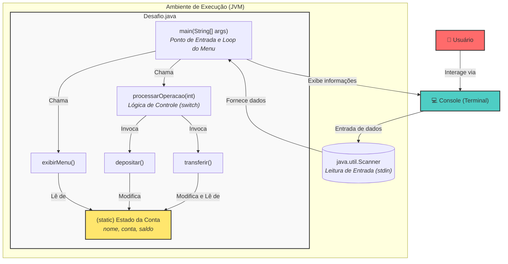
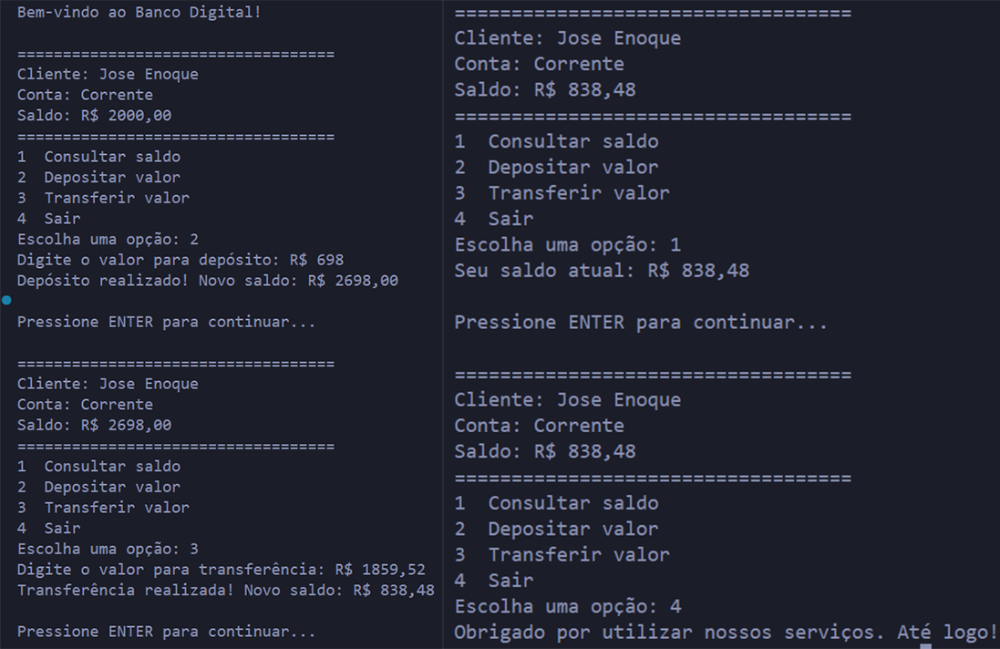

# DesafioJava1: Sistema Bancário Virtual em Java
*Simulando Transações Bancárias Essenciais com a Robustez do Java.*

## Abstract (Resumo Técnico)
Este projeto, intitulado "DesafioJava1", materializa o desenvolvimento de uma aplicação de console (CLI) em Java que simula as operações fundamentais de um sistema bancário. Concebido como um exercício prático para solidificar conceitos basilares da programação Java, o projeto aborda a necessidade de aplicar, em um cenário coeso, o uso de variáveis, estruturas de controle de fluxo (condicionais `switch` e laços `do-while`), manipulação de entrada e saída padrão (`java.util.Scanner`) e a decomposição procedural de lógica em métodos estáticos. O problema central resolvido é a transposição do conhecimento teórico para uma aplicação interativa e funcional. A solução proposta é uma interface de texto que permite a um usuário realizar consultas de saldo, depósitos e transferências, operando sobre um conjunto de dados pré-definido para um cliente fictício. A metodologia emprega uma arquitetura monolítica contida em uma única classe (`Desafio.java`), uma decisão deliberada para focar nos fundamentos procedimentais da linguagem. O resultado é um programa executável que demonstra com clareza as operações bancárias essenciais, servindo como uma ferramenta pedagógica eficaz para programadores iniciantes em Java. A contribuição do projeto reside em sua simplicidade focada e na aplicação direta de conceitos fundamentais em um domínio de problema compreensível e universal.

## Badges Abrangentes


## Sumário (Table of Contents)
1.  [Título do Projeto e Slogan Filosófico](#desafiojava1-sistema-bancário-virtual-em-java)
2.  [Abstract (Resumo Técnico)](#abstract-resumo-técnico)
3.  [Badges Abrangentes](#badges-abrangentes)
4.  [Sumário (Table of Contents)](#sumário-table-of-contents)
5.  [Introdução e Motivação](#introdução-e-motivação)
6.  [Arquitetura do Sistema](#arquitetura-do-sistema)
7.  [Decisões de Design Chave](#decisões-de-design-chave)
8.  [✨ Funcionalidades Detalhadas (com Casos de Uso)](#-funcionalidades-detalhadas-com-casos-de-uso)
9.  [🛠️ Tech Stack Detalhado](#️-tech-stack-detalhado)
10. [📂 Estrutura Detalhada do Código-Fonte](#-estrutura-detalhada-do-código-fonte)
11. [📋 Pré-requisitos Avançados](#-pré-requisitos-avançados)
12. [🚀 Guia de Instalação e Configuração Avançada](#-guia-de-instalação-e-configuração-avançada)
13. [⚙️ Uso Avançado e Exemplos](#️-uso-avançado-e-exemplos)
14. [🔧 API Reference (se aplicável)](#-api-reference-se-aplicável)
15. [🧪 Estratégia de Testes e Qualidade de Código](#-estratégia-de-testes-e-qualidade-de-código)
16. [🚢 Deployment Detalhado e Escalabilidade](#-deployment-detalhado-e-escalabilidade)
18. [📜 Licença e Aspectos Legais](#-licença-e-aspectos-legais)
19. [📚 Publicações, Artigos e Citações (se aplicável)](#-publicações-artigos-e-citações-se-aplicável)
20. [👥 Equipe Principal e Colaboradores Chave](#-equipe-principal-e-colaboradores-chave)
22. [❓ FAQ (Perguntas Frequentes)](#-faq-perguntas-frequentes)
23. [📞 Contato e Suporte](#-contato-e-suporte)

## Introdução e Motivação
O projeto "DesafioJava1" emerge da necessidade crítica no percurso de aprendizado de qualquer linguagem de programação: a aplicação pragmática de conceitos teóricos. No ecossistema Java, conhecido por sua robustez e vasta aplicabilidade, a maestria dos pilares da linguagem — manipulação de variáveis, estruturas de controle de fluxo, I/O e modularização de código — é um pré-requisito indispensável para a formação de um desenvolvedor competente. Este projeto, originado como um desafio de conclusão de curso, visa materializar esses conceitos em uma aplicação tangível: um sistema de conta bancária virtual.

A motivação primordial é, portanto, pedagógica. Em vez de se ater a exemplos fragmentados e abstratos, o projeto propõe a construção de uma aplicação interativa que simula um cenário do mundo real. Tal abordagem permite ao estudante não apenas compreender a sintaxe de um comando `if` ou `do-while`, mas também assimilar como essas estruturas se orquestram para construir uma lógica de negócio funcional. O domínio de um sistema bancário, com suas operações intuitivas de consulta, depósito e transferência, oferece um contexto familiar, permitindo que o foco cognitivo permaneça nos aspectos da programação.

A proposta de valor do projeto reside em sua simplicidade e interatividade focadas. Ao executar o programa, o desenvolvedor iniciante pode visualizar imediatamente o resultado de sua lógica, criando um ciclo de feedback positivo que reforça o aprendizado. A ausência deliberada de complexidades adicionais, como interfaces gráficas (GUI), persistência em banco de dados ou comunicação em rede, garante que a atenção seja inteiramente devotada aos fundamentos da programação procedural em Java. O objetivo é fornecer uma base sólida sobre a qual conhecimentos mais avançados, como orientação a objetos e arquiteturas multicamadas, possam ser construídos.

## Arquitetura do Sistema
A arquitetura do projeto é, por desígnio, minimalista, caracterizando-se como uma **aplicação monolítica de console (CLI)**. Toda a lógica de negócio, interação com o usuário e gerenciamento de estado estão encapsulados em uma única classe Java, `Desafio.java`. Esta escolha arquitetural visa maximizar o foco nos algoritmos e no fluxo de controle fundamental, eliminando a sobrecarga cognitiva de gerenciar múltiplos arquivos, pacotes ou camadas de abstração.



**Componentes e Fluxo:**

1.  **Usuário (User):** Interage com o sistema através de um terminal de linha de comando.
2.  **Console (Terminal):** Serve como a interface de entrada (stdin) e saída (stdout) para a aplicação.
3.  **`java.util.Scanner`:** Componente padrão do Java responsável por parsear a entrada de dados do usuário a partir do `System.in`.
4.  **`Desafio.java` (Classe Principal):**
    *   **Estado da Conta (Variáveis Estáticas):** As variáveis `nome`, `conta` e `saldo` são declaradas como `static`, significando que pertencem à classe em si, não a uma instância. Este estado é global e compartilhado por todos os métodos da classe.
    *   **`main()` (Método Principal):** Ponto de entrada da aplicação. Contém o loop principal (`do-while`) que gerencia o ciclo de vida do menu interativo, orquestrando chamadas para outros métodos.
    *   **Métodos de Operação (`depositar`, `transferir`):** Encapsulam a lógica de negócio específica para cada operação financeira, manipulando diretamente o estado estático da conta.
    *   **Métodos de UI/Controle (`exibirMenu`, `processarOperacao`):** Responsáveis por apresentar informações ao usuário e direcionar o fluxo da aplicação com base na entrada recebida.

A decisão por uma arquitetura procedural com métodos e variáveis estáticas é um trade-off consciente: sacrifica-se a pureza da orientação a objetos em favor de uma introdução mais suave aos conceitos de modularização e fluxo de controle para programadores iniciantes.

## Decisões de Design Chave
As escolhas de design e tecnologia foram guiadas pelo objetivo pedagógico central do projeto.

*   **Arquitetura Monolítica em Classe Única:** A contenção de toda a lógica em `Desafio.java` foi uma decisão deliberada para minimizar a complexidade estrutural. Para um iniciante, isso remove a necessidade de entender conceitos como pacotes, visibilidade entre classes e importações complexas, permitindo um foco total no algoritmo e no fluxo de controle.

*   **Uso de Membros `static`:** A utilização de variáveis e métodos estáticos é um pilar do design deste projeto. Isso permite a invocação de métodos e a manipulação de estado diretamente a partir do método `main` (que é estático por definição) sem a necessidade de instanciar um objeto (`new Desafio()`). Embora não seja um padrão ideal para aplicações complexas, é uma ferramenta didática eficaz para ensinar sobre escopo de classe e métodos utilitários antes de introduzir os conceitos completos de orientação a objetos.

*   **Interface de Linha de Comando (CLI):** A escolha por uma CLI em detrimento de uma GUI (Graphical User Interface) é fundamental. Ela abstrai as complexidades do gerenciamento de eventos, layout e bibliotecas gráficas (como Swing ou JavaFX), permitindo que o desenvolvedor se concentre exclusivamente na lógica de negócio e na manipulação de dados.

*   **Estado em Memória Volátil:** Os dados do cliente (nome, saldo) são hardcoded e existem apenas durante a execução do programa. Não há persistência em arquivos ou banco de dados. Esta simplificação é crucial para manter o escopo do projeto focado nos fundamentos da linguagem, adiando o aprendizado sobre I/O de arquivos e conectividade com bancos de dados.

*   **Estruturas de Controle Clássicas (`do-while`, `switch`):** A implementação do menu com um loop `do-while` e o tratamento das opções com uma estrutura `switch` são exemplos canônicos do uso dessas estruturas de controle, fornecendo um caso de estudo claro e prático de sua aplicação.

## ✨ Funcionalidades Detalhadas (com Casos de Uso)
O sistema oferece um conjunto coeso de operações bancárias básicas, acessíveis através de um menu interativo.

### 1. Consulta de Saldo
*   **Propósito:** Permite ao usuário visualizar o saldo monetário atual de sua conta.
*   **Caso de Uso:** O usuário seleciona a opção "1" no menu principal para uma verificação rápida de seus fundos disponíveis.
*   **Saída Esperada:**
    ```
    Seu saldo atual: R$ 2000.00
    ```

### 2. Depósito (Receber Valor)
*   **Propósito:** Permite ao usuário adicionar fundos à sua conta.
*   **Caso de Uso:** O usuário seleciona a opção "2", é solicitado a informar um valor, e o sistema atualiza o saldo. O sistema valida que o valor depositado seja positivo.
*   **Interação de Exemplo:**
    ```
    Escolha uma opção: 2
    Digite o valor para depósito: R$ 500.50
    Depósito realizado! Novo saldo: R$ 2500.50
    ```

### 3. Transferência (Transferir Valor)
*   **Propósito:** Permite ao usuário enviar fundos de sua conta.
*   **Caso de Uso:** O usuário seleciona a opção "3", informa o valor que deseja transferir. O sistema realiza duas validações críticas:
    1.  O valor a ser transferido deve ser positivo.
    2.  O valor a ser transferido não pode ser maior que o saldo atual.
*   **Interação de Sucesso:**
    ```
    Escolha uma opção: 3
    Digite o valor para transferência: R$ 300.00
    Transferência realizada! Novo saldo: R$ 2200.50
    ```
*   **Caso de Uso com Falha (Saldo Insuficiente):**
    ```
    Escolha uma opção: 3
    Digite o valor para transferência: R$ 3000.00
    Saldo insuficiente! Disponível: R$ 2200.50
    ```

### 4. Sair
*   **Propósito:** Encerra a sessão do usuário e finaliza a aplicação.
*   **Caso de Uso:** O usuário seleciona a opção "4" para terminar de usar o sistema bancário.
*   **Saída Esperada:**
    ```
    Obrigado por utilizar nossos serviços. Até logo!
    ```

### Demonstração da Aplicação
A imagem a seguir ilustra a aplicação em execução no terminal.

<div align="center">



</div>

## 🛠️ Tech Stack Detalhado
O stack tecnológico é intencionalmente minimalista para alinhar-se aos objetivos educacionais do projeto.

| Categoria | Tecnologia | Versão Específica | Propósito no Projeto | Justificativa da Escolha |
| :--- | :--- | :--- | :--- | :--- |
| **Linguagem** | Java | 11+ | Linguagem principal para toda a lógica da aplicação. | Escolhida por sua robustez, tipagem forte, vasta documentação e posição como pilar no ensino de programação estruturada e orientada a objetos. |
| **Ambiente de Execução** | JDK (Java Development Kit) | 11+ | Fornece o compilador (`javac`) e a Máquina Virtual Java (`java`) para compilar e executar o código-fonte. | Requisito padrão e essencial para qualquer desenvolvimento em Java. |
| **IDE (Ambiente de Desenvolvimento)** | IntelliJ IDEA (inferido) | N/A | Ferramenta utilizada para escrita, depuração e execução do código. | Inferido pela presença do diretório `.idea` no `.gitignore`. É uma IDE líder de mercado para Java, oferecendo excelentes ferramentas de análise de código e produtividade. |
| **Biblioteca Padrão** | `java.util.Scanner` | N/A | Componente da biblioteca padrão do Java para ler a entrada do usuário a partir do console. | Solução canônica e simples para I/O de console em Java, sem a necessidade de dependências externas. |

## 📂 Estrutura Detalhada do Código-Fonte
A estrutura do projeto é simples e direta, refletindo seu escopo conciso.

```
DesafioJava1-main/
├── .gitignore          # Especifica arquivos e diretórios a serem ignorados pelo Git (ex: metadados do IDE, arquivos compilados).
├── Desafio.java        # Arquivo único contendo todo o código-fonte da aplicação em Java.
├── Desafio.md          # Documento Markdown com a especificação original do desafio, objetivos e requisitos.
├── README.md           # Este arquivo de documentação detalhada do projeto.
└── imgs/
    └── javademo.png    # Imagem de screenshot demonstrando a aplicação em uso.
```

## 📋 Pré-requisitos Avançados
Para compilar e executar este projeto em um ambiente local, os seguintes componentes são necessários:

*   **Java Development Kit (JDK):** Versão 11 ou superior. É crucial ter o JDK instalado e as variáveis de ambiente (`JAVA_HOME`, `PATH`) configuradas corretamente.
*   **Git:** Para clonar o repositório a partir do GitHub.
*   **IDE (Opcional, mas recomendado):** Um Ambiente de Desenvolvimento Integrado como [IntelliJ IDEA](https://www.jetbrains.com/idea/), [Eclipse](https://www.eclipse.org/ide/) ou [Visual Studio Code](https://code.visualstudio.com/) com extensões para Java facilitará a compilação, execução e depuração.

## 🚀 Guia de Instalação e Configuração Avançada
Siga os passos abaixo para obter uma cópia local do projeto e executá-la.

1.  **Clonar o Repositório:**
    Abra um terminal ou prompt de comando e execute o seguinte comando Git:
    ```bash
    git clone https://github.com/ESousa97/DesafioJava1.git
    ```

2.  **Navegar para o Diretório:**
    Entre na pasta do projeto que foi criada:
    ```bash
    cd DesafioJava1-main
    ```

3.  **Compilar e Executar (via Linha de Comando):**

    *   **Compilar:** Use o compilador Java para gerar o bytecode (`.class` file).
        ```bash
        javac Desafio.java
        ```
    *   **Executar:** Inicie a aplicação usando a Java Virtual Machine (JVM).
        ```bash
        java Desafio
        ```

4.  **Executar (via IDE):**
    *   Abra seu IDE de preferência (ex: IntelliJ IDEA).
    *   Selecione "Open" ou "Import Project" e aponte para a pasta `DesafioJava1-main` que você clonou.
    *   Localize o arquivo `Desafio.java`.
    *   Clique com o botão direito no método `main` e selecione "Run 'Desafio.main()'".

## ⚙️ Uso Avançado e Exemplos
Para ilustrar o fluxo completo da aplicação, considere a seguinte sessão de usuário, que demonstra todas as funcionalidades, incluindo o tratamento de erros.

```
// Início da sessão
Bem-vindo ao Banco Digital!

===================================
Cliente: Jose Enoque
Conta: Corrente
Saldo: R$ 2000.00
===================================
1  Consultar saldo
2  Depositar valor
3  Transferir valor
4  Sair
Escolha uma opção: 1
Seu saldo atual: R$ 2000.00

Pressione ENTER para continuar...

// Depósito
===================================
Cliente: Jose Enoque
Conta: Corrente
Saldo: R$ 2000.00
===================================
...
Escolha uma opção: 2
Digite o valor para depósito: R$ 750
Depósito realizado! Novo saldo: R$ 2750.00

Pressione ENTER para continuar...

// Tentativa de transferência com saldo insuficiente
===================================
Cliente: Jose Enoque
Conta: Corrente
Saldo: R$ 2750.00
===================================
...
Escolha uma opção: 3
Digite o valor para transferência: R$ 3000
Saldo insuficiente! Disponível: R$ 2750.00

Pressione ENTER para continuar...

// Transferência bem-sucedida
===================================
Cliente: Jose Enoque
Conta: Corrente
Saldo: R$ 2750.00
===================================
...
Escolha uma opção: 3
Digite o valor para transferência: R$ 1250
Transferência realizada! Novo saldo: R$ 1500.00

Pressione ENTER para continuar...

// Sair do sistema
===================================
Cliente: Jose Enoque
Conta: Corrente
Saldo: R$ 1500.00
===================================
...
Escolha uma opção: 4
Obrigado por utilizar nossos serviços. Até logo!
```

## 🔧 API Reference (se aplicável)
Não aplicável. Este projeto é uma aplicação de console (CLI) autônoma e não expõe uma API de rede (como REST ou gRPC).

## 🧪 Estratégia de Testes e Qualidade de Código
Dado o escopo didático do projeto, uma suíte de testes automatizados formais (e.g., com JUnit) não foi implementada. A validação da corretude do software foi realizada através de **testes manuais exploratórios**, seguindo os cenários de uso definidos na especificação do desafio.

A estratégia de testes manuais cobriu os seguintes casos:
*   **Caminho Feliz:** Execução de todas as operações (consulta, depósito, transferência) com entradas válidas e resultados esperados.
*   **Validação de Entradas:**
    *   Inserção de opções de menu inválidas (ex: `5`, `0`, `abc`).
    *   Inserção de valores monetários não numéricos ou negativos.
*   **Regras de Negócio:**
    *   Verificação de que o saldo é atualizado corretamente após depósitos e transferências.
    *   Teste do cenário de transferência com valor superior ao saldo disponível.
*   **Fluxo da Aplicação:** Confirmação de que o menu continua em loop até que a opção "Sair" seja selecionada.

A **qualidade do código** foi mantida através de:
*   **Modularização:** Divisão da lógica em métodos privados e estáticos com responsabilidades claras (`exibirMenu`, `processarOperacao`, `depositar`, etc.).
*   **Nomenclatura:** Uso de nomes de variáveis e métodos descritivos em português.
*   **Comentários (Javadoc):** Documentação no nível de método para explicar o propósito de cada bloco de código.
*   **Tratamento de Exceções:** Uso de blocos `try-catch` para lidar com `InputMismatchException`, prevenindo que a aplicação quebre com entradas inválidas do usuário.

## 🚢 Deployment Detalhado e Escalabilidade
Este projeto foi desenhado como uma aplicação local e não se destina a um deployment em ambiente de servidor ou nuvem. Sua execução está contida na máquina do usuário.

**Considerações sobre Escalabilidade (Análise Teórica):**
A arquitetura atual, baseada em estado estático e volátil em memória, não é escalável. Para evoluir este protótipo para um sistema robusto e escalável, as seguintes modificações arquiteturais seriam necessárias:
1.  **Persistência de Estado:** Substituir as variáveis estáticas por um mecanismo de persistência, como um banco de dados relacional (PostgreSQL, MySQL) ou NoSQL (MongoDB), para armazenar os dados de clientes e contas de forma durável.
2.  **Serviço de Backend:** Encapsular a lógica de negócio em uma API RESTful, utilizando um framework como Spring Boot. Isso desacoplaria a lógica do cliente.
3.  **Containerização:** Empacotar a aplicação de backend em um contêiner Docker para garantir a portabilidade e consistência entre ambientes.
4.  **Orquestração e Nuvem:** Realizar o deploy dos contêineres em uma plataforma de nuvem (AWS, GCP, Azure) usando um orquestrador como Kubernetes para gerenciar escalabilidade horizontal, balanceamento de carga e resiliência.

## 📜 Licença e Aspectos Legais

Este projeto está licenciado sob a [Licença MIT](/LICENSE) - consulte o arquivo LICENSE para mais detalhes.

### Resumo da Licença MIT

A Licença MIT é uma licença de software livre e de código aberto que permite:

- ✅ **Uso comercial** - Você pode usar este software em projetos comerciais
- ✅ **Modificação** - Você pode modificar o código conforme necessário
- ✅ **Distribuição** - Você pode distribuir cópias do software
- ✅ **Uso privado** - Você pode usar o software para fins pessoais
- ✅ **Sublicenciamento** - Você pode sublicenciar o software

### Responsabilidades

- 📋 **Aviso de copyright** - Deve incluir o aviso de copyright original
- 📋 **Texto da licença** - Deve incluir o texto completo da licença MIT

### Isenção de Responsabilidade

⚠️ **IMPORTANTE**: Este software é fornecido "como está", sem garantias de qualquer tipo. Este é um projeto educacional desenvolvido para fins de aprendizado e não deve ser utilizado em sistemas bancários reais ou para transações financeiras efetivas.

---

**Nota**: Este projeto foi desenvolvido como parte do curso da Alura para fins educacionais e demonstração de conceitos de programação Java.

## 📚 Publicações, Artigos e Citações (se aplicável)
Não aplicável a este projeto neste momento.

## 👥 Equipe Principal e Colaboradores Chave
*   **Autor:** [Enoque Sousa](https://www.linkedin.com/in/enoque-sousa-bb89aa168/)

Este projeto foi desenvolvido como parte de um desafio prático, possivelmente no contexto de cursos de formação em Java, como os oferecidos pela Alura.

## ❓ FAQ (Perguntas Frequentes)
*   **P: Por que o saldo da conta é resetado toda vez que eu executo o programa?**
    *   **R:** O estado da conta (incluindo o saldo) é armazenado em variáveis na memória, que são voláteis. O estado não é salvo em disco. Esta é uma simplificação deliberada para focar nos fundamentos da linguagem Java, sem introduzir a complexidade de I/O de arquivos.

*   **P: Por que o código utiliza `static` para quase tudo?**
    *   **R:** Esta foi uma decisão de design pedagógica para simplificar o projeto para iniciantes. Permite que toda a lógica seja executada a partir do método `main` sem a necessidade de instanciar objetos. Um passo natural de evolução do projeto seria refatorá-lo para um modelo orientado a objetos, conforme descrito no Roadmap.

*   **P: O que acontece se eu digitar texto em vez de um número para uma opção ou valor?**
    *   **R:** A aplicação possui tratamento de exceções (`try-catch`) para `InputMismatchException`. Ela informará que a entrada é inválida e solicitará que você tente novamente, sem quebrar a execução.

*   **P: Como posso compilar e executar o projeto?**
    *   **R:** As instruções detalhadas estão disponíveis na seção [🚀 Guia de Instalação e Configuração Avançada](#-guia-de-instalação-e-configuração-avançada).

## 📞 Contato e Suporte
Para relatar bugs, fazer perguntas ou sugerir melhorias, o canal preferencial é a seção de **Issues** do repositório no GitHub.

*   **[Abrir uma Issue no GitHub](https://github.com/ESousa97/DesafioJava1/issues)**

---

> ✨ **Criado em:** 9 de jun. de 2025 às 22:13