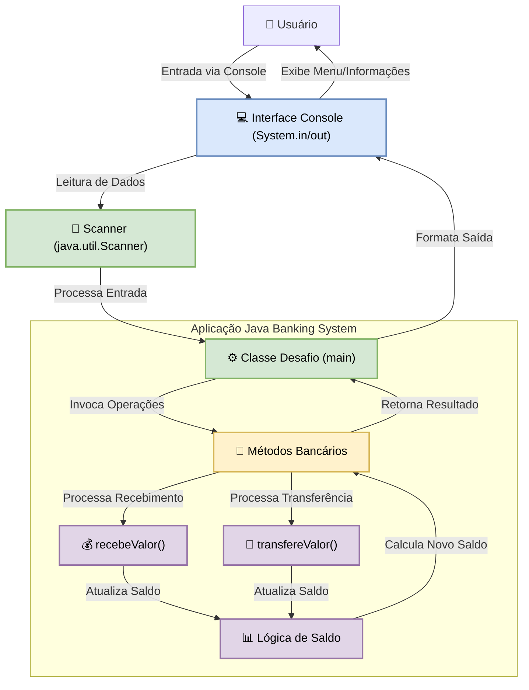

# DesafioJava1: Sistema Bancário Virtual em Java
*Simulando Transações Bancárias Essenciais com a Robustez do Java.*

## Abstract (Resumo Técnico)
Este projeto, intitulado "DesafioJava1", consiste no desenvolvimento de uma aplicação de console (CLI) em Java que simula as operações básicas de um sistema bancário virtual. Concebido como um exercício prático, possivelmente no contexto de um curso de programação Java (como o curso Alura, mencionado no código-fonte), o sistema aborda a necessidade de consolidar conceitos fundamentais da linguagem Java. O problema central que o projeto visa resolver é a aplicação prática de variáveis, estruturas condicionais (como `switch`), estruturas de repetição (`do-while`), manipulação de entrada do usuário (via `java.util.Scanner`), e a modularização de código através de métodos. A solução proposta é uma interface interativa baseada em texto que permite ao usuário realizar consultas de saldo, depósitos (receber valor) e saques/transferências (transferir valor), operando sobre dados pré-definidos de um cliente fictício. A metodologia principal emprega uma classe única (`Desafio.java`) contendo a lógica de negócios e interação, com métodos dedicados para as operações financeiras. O resultado é um programa funcional que demonstra de forma clara e concisa as operações bancárias essenciais, servindo como uma ferramenta didática eficaz para programadores iniciantes em Java. A contribuição do projeto reside em sua simplicidade e foco na aplicação direta de conceitos de programação procedural e orientada a objetos em um cenário prático e compreensível.

## Badges Abrangentes


## Sumário (Table of Contents)
1.  [Título do Projeto e Slogan Filosófico](#desafiojava1-sistema-bancário-virtual-em-java)
2.  [Abstract (Resumo Técnico)](#abstract-resumo-técnico)
3.  [Badges Abrangentes](#badges-abrangentes)
4.  [Sumário (Table of Contents)](#sumário-table-of-contents)
5.  [Introdução e Motivação](#introdução-e-motivação)
6.  [Arquitetura do Sistema](#arquitetura-do-sistema)
7.  [Decisões de Design Chave](#decisões-de-design-chave)
8.  [✨ Funcionalidades Detalhadas (com Casos de Uso)](#-funcionalidades-detalhadas-com-casos-de-uso)
9.  [🛠️ Tech Stack Detalhado](#️-tech-stack-detalhado)
10. [📂 Estrutura Detalhada do Código-Fonte](#-estrutura-detalhada-do-código-fonte)
11. [📋 Pré-requisitos Avançados](#-pré-requisitos-avançados)
12. [🚀 Guia de Instalação e Configuração Avançada](#-guia-de-instalação-e-configuração-avançada)
13. [⚙️ Uso Avançado e Exemplos](#️-uso-avançado-e-exemplos)
14. [🔧 API Reference (se aplicável)](#-api-reference-se-aplicável)
15. [🧪 Estratégia de Testes e Qualidade de Código](#-estratégia-de-testes-e-qualidade-de-código)
16. [🚢 Deployment Detalhado e Escalabilidade](#-deployment-detalhado-e-escalabilidade)
17. [🤝 Contribuição (Nível Avançado)](#-contribuição-nível-avançado)
18. [📜 Licença e Aspectos Legais](#-licença-e-aspectos-legais)
19. [📚 Publicações, Artigos e Citações (se aplicável)](#-publicações-artigos-e-citações-se-aplicável)
20. [👥 Equipe Principal e Colaboradores Chave](#-equipe-principal-e-colaboradores-chave)
21. [🗺️ Roadmap Detalhado e Visão de Longo Prazo](#️-roadmap-detalhado-e-visão-de-longo-prazo)
22. [❓ FAQ (Perguntas Frequentes)](#-faq-perguntas-frequentes)
23. [📞 Contato e Suporte](#-contato-e-suporte)

## Introdução e Motivação
O projeto "DesafioJava1" emerge da necessidade fundamental no aprendizado de qualquer linguagem de programação: a aplicação prática dos conceitos teóricos. Especificamente no universo Java, que abrange desde aplicações desktop robustas até complexos sistemas empresariais, a consolidação dos pilares da linguagem — como manipulação de variáveis, estruturas de controle de fluxo (condicionais e laços de repetição), entrada e saída de dados, e a organização do código em métodos — é crucial para o desenvolvimento de um programador proficiente. Este projeto, referenciado no código-fonte como o "Desafio final do curso Alura", visa materializar esses conceitos em um sistema de conta bancária virtual.

A motivação central é, portanto, didática. Em vez de se limitar a exemplos isolados, o projeto propõe a construção de uma pequena aplicação interativa que simula um cenário do mundo real. Isso permite ao aprendiz não apenas entender a sintaxe de um comando `if` ou `while`, mas também compreender como essas estruturas se integram para construir uma lógica de negócios funcional. O sistema bancário, com suas operações intuitivas de consulta, depósito e transferência, oferece um domínio familiar e acessível, facilitando o foco nos aspectos de programação.

A proposta de valor reside na simplicidade e na interatividade. Ao executar o programa, o usuário/estudante pode visualizar imediatamente o resultado de suas interações e da lógica implementada, reforçando o aprendizado. A ausência de complexidades como interfaces gráficas (GUI), persistência de dados em banco de dados ou comunicação em rede permite que a atenção seja totalmente direcionada aos fundamentos da programação em Java. O objetivo de longo prazo é fornecer uma base sólida sobre a qual conhecimentos mais avançados possam ser construídos, servindo como um "hello world" mais elaborado e funcional para aspirantes a desenvolvedores Java.

## Arquitetura do Sistema
Dada a natureza didática e a escopo conciso do projeto, a arquitetura adotada é inerentemente simples, caracterizando-se como uma aplicação monolítica de console (CLI - Command Line Interface). Toda a lógica reside em um único arquivo Java, `Desafio.java`.

**Componentes Principais:**
1.  **`Desafio.java` (Classe Principal):**
    *   **Responsabilidade:** Contém o ponto de entrada da aplicação (`main` method), gerencia o ciclo de vida do menu interativo, armazena os dados do cliente (nome, tipo de conta, saldo) em variáveis locais, e invoca os métodos para as operações bancárias.
    *   **Interações:** Recebe entrada do usuário através do `Scanner` e exibe informações no console.
2.  **`java.util.Scanner` (Componente de Entrada):**
    *   **Responsabilidade:** Obter a entrada de dados fornecida pelo usuário através do console (stdin).
    *   **Interações:** Fornece os dados digitados pelo usuário para a classe `Desafio` para processamento.
3.  **Métodos de Operação (`recebeValor`, `transfereValor`):**
    *   **Responsabilidade:** Encapsulam a lógica específica para as operações de depósito e transferência, respectivamente. Realizam cálculos de saldo e validações.
    *   **Interações:** São chamados pelo método `main` e retornam o saldo atualizado ou o saldo original em caso de falha na operação.
4.  **Console (Interface com Usuário):**
    *   **Responsabilidade:** Meio pelo qual o usuário interage com a aplicação, fornecendo comandos numéricos e visualizando os resultados das operações e o estado da conta.

**Diagrama de Arquitetura (Simplificado):**


**Discussão das Decisões Arquiteturais:**
*   **Monolítico em Arquivo Único:** A escolha de concentrar todo o código em um único arquivo (`Desafio.java`) e uma única classe foi deliberada para manter a simplicidade máxima, alinhada com o objetivo de ser um projeto introdutório. Isso evita a complexidade de gerenciamento de múltiplos arquivos, pacotes ou uma estrutura de projeto mais elaborada, permitindo que o foco permaneça na lógica fundamental.
*   **Aplicação de Console (CLI):** Utilizar uma interface de linha de comando simplifica o desenvolvimento, eliminando a necessidade de lidar com bibliotecas de GUI (Graphical User Interface) e permitindo que o desenvolvedor se concentre puramente na lógica de backend e no fluxo de controle da aplicação.
*   **Estado em Memória:** Os dados do cliente (nome, tipo de conta, saldo) são mantidos em variáveis locais dentro do método `main`. Esta abordagem é a mais simples para um projeto de aprendizado, embora signifique que os dados são voláteis e perdidos quando a aplicação é encerrada. A persistência de dados (em arquivos ou banco de dados) seria um passo subsequente natural para expandir o projeto.

Esta arquitetura, embora minimalista, é perfeitamente adequada para os objetivos educacionais do projeto, permitindo uma clara visualização do fluxo de execução e da interação entre os poucos componentes envolvidos.

## Decisões de Design Chave
As decisões de design para o "DesafioJava1" foram guiadas primariamente pela simplicidade, clareza didática e pelos requisitos implícitos de um projeto introdutório de programação.

1.  **Linguagem de Programação: Java**
    *   **Justificativa:** O projeto é explicitamente um "Desafio Java", provavelmente parte de um currículo de aprendizado da linguagem Java (como o curso Alura). A escolha do Java é, portanto, um requisito fundamental.
    *   **Trade-offs:** Java é uma linguagem robusta e amplamente utilizada, mas sua verbosidade e a necessidade de um ambiente de execução (JRE/JDK) podem apresentar uma curva de aprendizado inicial maior em comparação com linguagens de script para tarefas simples. No entanto, para o propósito de aprender os fundamentos de uma linguagem tipada e orientada a objetos, é uma escolha sólida.

2.  **Estrutura de Código: Classe Única (`Desafio.java`)**
    *   **Justificativa:** Para um projeto de escopo tão limitado, manter todo o código em uma única classe e arquivo simplifica a compilação, execução e compreensão para iniciantes. Evita a necessidade de introduzir conceitos de pacotes ou múltiplas classes interconectadas prematuramente.
    *   **Trade-offs:** Esta abordagem não escala bem para projetos maiores e não demonstra completamente os princípios de design orientado a objetos, como encapsulamento e separação de responsabilidades em múltiplas classes (ex: uma classe `Conta`, uma classe `Cliente`). Contudo, para este desafio, a simplicidade prevaleceu.

3.  **Interface com o Usuário: Console (CLI) via `System.out` e `Scanner`**
    *   **Justificativa:** `System.out.println()` para saída e `java.util.Scanner` para entrada são as formas padrão e mais diretas de interagir com o usuário em aplicações Java de console. São conceitos básicos ensinados no início do aprendizado de Java.
    *   **Trade-offs:** Interfaces CLI são menos amigáveis e visualmente atraentes que GUIs. A validação de entrada pode ser mais rudimentar. No entanto, para focar na lógica de programação, a CLI é ideal por sua baixa sobrecarga de desenvolvimento.

4.  **Controle de Fluxo do Menu: `do-while` e `switch`**
    *   **Justificativa:** O laço `do-while` é adequado para menus que devem executar pelo menos uma vez e continuar até uma condição de saída ser satisfeita (opção "Sair"). A estrutura `switch` é uma forma clara e eficiente de lidar com múltiplas opções discretas do menu.
    *   **Trade-offs:** Para um número muito grande de opções, um `switch` pode se tornar extenso. Alternativas como mapas de comandos ou padrões de projeto (como o Command Pattern) seriam excessivas para este escopo.

5.  **Modularização: Métodos Estáticos (`recebeValor`, `transfereValor`)**
    *   **Justificativa:** A extração da lógica de recebimento e transferência de valores para métodos separados (`recebeValor` e `transfereValor`) melhora a legibilidade e a organização do método `main`. Torná-los estáticos permite que sejam chamados diretamente da classe `Desafio` sem a necessidade de instanciar um objeto `Desafio`, o que simplifica o fluxo no contexto de um `main` estático.
    *   **Trade-offs:** O uso excessivo de métodos estáticos pode levar a um design menos orientado a objetos. Em um projeto maior, essas operações seriam tipicamente métodos de instância de uma classe `Conta`.

6.  **Gerenciamento de Dados do Cliente: Variáveis Locais no `main`**
    *   **Justificativa:** Para simular uma única conta com dados fixos, armazenar nome, tipo de conta e saldo em variáveis locais dentro do método `main` é a abordagem mais simples e direta.
    *   **Trade-offs:** Os dados são voláteis (perdidos ao sair da aplicação) e não há suporte para múltiplas contas ou persistência. Isso é aceitável para um exercício focado na lógica de operações, não no gerenciamento de dados.

7.  **Tratamento de Erros e Validações: Condicionais `if-else`**
    *   **Justificativa:** Validações básicas, como verificar se o valor a ser recebido/transferido é positivo ou se há saldo suficiente, são implementadas usando estruturas `if-else`. Mensagens de erro são impressas diretamente no console.
    *   **Trade-offs:** O tratamento de erros é simples. Não utiliza exceções Java de forma explícita para todos os cenários de erro (ex: entrada não numérica para `scanner.nextInt()` resultaria em `InputMismatchException` não tratada, encerrando o programa). Para um projeto didático inicial, focar nas validações lógicas é um bom começo.

Essas decisões refletem um foco em construir uma aplicação funcional mínima que demonstre os conceitos Java essenciais de forma clara e concisa, priorizando o aprendizado sobre a robustez ou escalabilidade de um software de produção.

## ✨ Funcionalidades Detalhadas (com Casos de Uso)
O sistema bancário virtual oferece um conjunto conciso de funcionalidades essenciais para a simulação de uma conta bancária. Todas as interações ocorrem através de um menu de console.

**Dados Iniciais do Cliente (Fixos na Implementação):**
*   **Nome:** Jose Enoque
*   **Tipo da Conta:** Corrente
*   **Saldo Inicial:** R$ 2000,00 (Conforme `Desafio.java`)

**Menu de Operações:**
Ao iniciar, o sistema exibe os dados do cliente e o seguinte menu:
```
Operações:
1. Consultar saldo
2. Receber valor
3. Transferir valor
4. Sair
Escolha uma opção:
```

---

### 1. Consultar Saldo (Opção 1)
*   **Propósito:** Permite ao usuário visualizar o saldo monetário atual disponível em sua conta.
*   **Funcionamento:** Ao selecionar a opção '1', o sistema exibe uma mensagem formatada com o saldo atual.
*   **Caso de Uso:**
    1.  Usuário inicia a aplicação.
    2.  O menu de operações é exibido.
    3.  Usuário digita `1` e pressiona Enter.
    4.  O sistema exibe: `Seu saldo atual é de: R$ 2000.00` (ou o saldo correspondente após outras operações).

---

### 2. Receber Valor (Opção 2)
*   **Propósito:** Permite ao usuário simular o recebimento (depósito) de um valor em sua conta, aumentando o saldo.
*   **Funcionamento:**
    1.  Ao selecionar a opção '2', o sistema solicita que o usuário digite o valor a ser recebido.
    2.  O valor digitado é lido.
    3.  **Validação:** O sistema verifica se o valor é positivo (maior que zero).
        *   Se inválido (<= 0), exibe "Valor inválido! O valor deve ser maior que zero." e o saldo permanece inalterado.
        *   Se válido, o valor é somado ao saldo atual.
    4.  O sistema exibe uma mensagem de confirmação com o novo saldo: `Valor recebido! Novo saldo: R$ X.XX`.
*   **Caso de Uso (Sucesso):**
    1.  Saldo atual: R$ 2000,00.
    2.  Usuário escolhe a opção `2`.
    3.  Sistema solicita: `Digite o valor a receber: R$ `
    4.  Usuário digita `500.00` e pressiona Enter.
    5.  Sistema exibe: `Valor recebido! Novo saldo: R$ 2500.00`.
*   **Caso de Uso (Valor Inválido):**
    1.  Saldo atual: R$ 2000,00.
    2.  Usuário escolhe a opção `2`.
    3.  Sistema solicita: `Digite o valor a receber: R$ `
    4.  Usuário digita `-100.00` e pressiona Enter.
    5.  Sistema exibe: `Valor inválido! O valor deve ser maior que zero.`
    6.  Saldo permanece R$ 2000,00.

---

### 3. Transferir Valor (Opção 3)
*   **Propósito:** Permite ao usuário simular a transferência (saque ou envio) de um valor de sua conta, diminuindo o saldo.
*   **Funcionamento:**
    1.  Ao selecionar a opção '3', o sistema solicita que o usuário digite o valor a ser transferido.
    2.  O valor digitado é lido.
    3.  **Validação de Valor:** O sistema verifica se o valor é positivo (maior que zero).
        *   Se inválido (<= 0), exibe "Valor inválido! O valor deve ser maior que zero." e o saldo permanece inalterado.
    4.  **Validação de Saldo:** Se o valor for positivo, o sistema verifica se o valor da transferência é menor ou igual ao saldo atual.
        *   Se houver saldo suficiente, o valor é subtraído do saldo atual. O sistema exibe: `Transferência realizada! Novo saldo: R$ Y.YY`.
        *   Se não houver saldo suficiente, exibe: `Saldo insuficiente para a transferência!` e `Saldo disponível: R$ Z.ZZ`. O saldo permanece inalterado.
*   **Caso de Uso (Sucesso):**
    1.  Saldo atual: R$ 2500,00.
    2.  Usuário escolhe a opção `3`.
    3.  Sistema solicita: `Digite o valor a transferir: R$ `
    4.  Usuário digita `300.00` e pressiona Enter.
    5.  Sistema exibe: `Transferência realizada! Novo saldo: R$ 2200.00`.
*   **Caso de Uso (Saldo Insuficiente):**
    1.  Saldo atual: R$ 2200,00.
    2.  Usuário escolhe a opção `3`.
    3.  Sistema solicita: `Digite o valor a transferir: R$ `
    4.  Usuário digita `3000.00` e pressiona Enter.
    5.  Sistema exibe:
        ```
        Saldo insuficiente para a transferência!
          Saldo disponível: R$ 2200.00
        ```
    6.  Saldo permanece R$ 2200,00.
*   **Caso de Uso (Valor Inválido):**
    1.  Saldo atual: R$ 2200,00.
    2.  Usuário escolhe a opção `3`.
    3.  Sistema solicita: `Digite o valor a transferir: R$ `
    4.  Usuário digita `0` e pressiona Enter.
    5.  Sistema exibe: `Valor inválido! O valor deve ser maior que zero.`
    6.  Saldo permanece R$ 2200,00.

---

### 4. Sair (Opção 4)
*   **Propósito:** Encerra a execução da aplicação do sistema bancário virtual.
*   **Funcionamento:** Ao selecionar a opção '4', o sistema exibe uma mensagem de despedida e o programa termina.
*   **Caso de Uso:**
    1.  Usuário está interagindo com o menu.
    2.  Usuário digita `4` e pressiona Enter.
    3.  Sistema exibe: `Obrigado por utilizar nosso sistema! Agora você pode ir com segurança!`
    4.  A aplicação é encerrada.

---

### Validação de Opção Inválida no Menu
*   **Propósito:** Lidar com entradas do usuário no menu principal que não correspondem a nenhuma das opções válidas (1, 2, 3 ou 4).
*   **Funcionamento:** Se o usuário digitar um número (ou qualquer entrada que não seja convertida para 1-4 pela lógica do `switch`) diferente das opções válidas, o sistema exibe uma mensagem de erro e reapresenta o menu.
*   **Caso de Uso:**
    1.  Usuário inicia a aplicação.
    2.  O menu de operações é exibido.
    3.  Usuário digita `5` (ou qualquer outro número inválido) e pressiona Enter.
    4.  Sistema exibe: `Opção inválida! Tente novamente!`
    5.  O menu é exibido novamente.

Este conjunto de funcionalidades, embora básico, cobre o ciclo essencial de operações de uma conta bancária e permite a prática de diversos conceitos de programação Java.

## 🛠️ Tech Stack Detalhado
A pilha tecnológica deste projeto é minimalista, refletindo seu propósito como um exercício fundamental de programação em Java.

| Categoria      | Tecnologia        | Versão Específica (se aplicável) | Propósito no Projeto                                                                 | Justificativa da Escolha                                                                                                     |
|----------------|-------------------|---------------------------------|--------------------------------------------------------------------------------------|------------------------------------------------------------------------------------------------------------------------------|
| Linguagem      | Java              | JDK 8 ou superior (inferido pela sintaxe e práticas comuns) | Implementação central de toda a lógica do sistema bancário virtual.                   | Requisito do desafio (mencionado como "Desafio Java" e "curso Alura"); linguagem robusta, orientada a objetos e amplamente utilizada para aprendizado e desenvolvimento. |
| Ambiente de Execução | Java Virtual Machine (JVM) | Correspondente ao JDK utilizado | Execução do bytecode Java compilado.                                                 | Padrão para qualquer aplicação Java.                                                                                        |
| Interface com Usuário | Console (CLI)     | N/A                             | Fornecer uma interface baseada em texto para interação do usuário com o sistema.       | Simplicidade de implementação, permitindo foco total na lógica de programação sem as complexidades de uma GUI.               |
| Bibliotecas Padrão Java SE | `java.util.Scanner` | Incluída no Java SE (Standard Edition) | Leitura de entrada de dados fornecida pelo usuário através do console (System.in).     | Ferramenta padrão e direta da biblioteca Java para manipulação de entrada de console, ideal para iniciantes.                 |
| Bibliotecas Padrão Java SE | `System.out`      | Incluído no Java SE             | Exibição de informações, menus e resultados para o usuário no console (System.out). | Mecanismo padrão do Java para saída de dados no console.                                                                     |
| Ferramenta de Desenvolvimento (IDE) | IntelliJ IDEA (sugerido) | Qualquer versão compatível | Desenvolvimento, compilação, execução e depuração do código Java.                  | O arquivo `.gitignore` (com `.idea/` e `out/`) e o `Desafio.md` sugerem o uso do IntelliJ IDEA. É uma IDE popular e poderosa para Java, facilitando o desenvolvimento. |
| Sistema de Build | (Implícito via IDE ou `javac`) | N/A                             | Compilação do código-fonte `.java` para bytecode `.class`.                           | Para um projeto de arquivo único, um sistema de build formal como Maven ou Gradle não é estritamente necessário e adicionaria complexidade desnecessária para o escopo do desafio. A compilação pode ser feita diretamente pelo compilador `javac` ou pela IDE. |

Este stack tecnológico é intencionalmente enxuto para garantir que o foco permaneça nos fundamentos da linguagem Java e na lógica de programação básica, alinhado com os objetivos de um desafio de aprendizado.

## 📂 Estrutura Detalhada do Código-Fonte
O projeto possui uma estrutura de arquivos extremamente simples, consistindo em um diretório raiz que contém os arquivos essenciais.

```
DesafioJava1-main/
├── .gitignore          # Arquivo de configuração do Git para ignorar arquivos e pastas específicos.
├── Desafio.java        # O único arquivo de código-fonte Java, contendo toda a lógica da aplicação.
└── Desafio.md          # Arquivo Markdown original descrevendo o desafio (provavelmente o enunciado).
```

**Análise dos Componentes:**

*   **`DesafioJava1-main/` (Diretório Raiz):**
    *   Este é o diretório principal que encapsula todos os artefatos do projeto. O nome sugere que foi extraído de um repositório ou arquivo zip chamado `DesafioJava1-main`.

*   **`.gitignore`:**
    *   **Propósito:** Especifica intencionalmente arquivos e diretórios não rastreados que o Git deve ignorar.
    *   **Conteúdo Relevante:**
        ```
        .idea
        out
        ```
    *   **Análise:**
        *   `.idea/`: Diretório usado pelo IntelliJ IDEA para armazenar configurações específicas do projeto. Sua inclusão no `.gitignore` é uma prática padrão para evitar que configurações de IDE pessoais sejam versionadas.
        *   `out/`: Diretório padrão onde o IntelliJ IDEA (e outras IDEs/ferramentas de build) geralmente coloca os arquivos compilados (`.class` files) e outros artefatos de build. Também é uma prática padrão ignorá-lo.
    *   **Implicação:** A presença e conteúdo deste arquivo reforçam a inferência de que o projeto foi desenvolvido ou é destinado a ser trabalhado com o IntelliJ IDEA.

*   **`Desafio.java`:**
    *   **Propósito:** Este é o coração da aplicação. Contém todo o código Java que implementa o sistema bancário virtual.
    *   **Estrutura Interna (Simplificada):**
        *   Declaração de importação: `import java.util.Scanner;`
        *   Classe pública `Desafio`.
        *   Método estático `public static void main(String[] args)`.
            *   Inicialização do `Scanner`.
            *   Declaração e inicialização de variáveis para dados do cliente (nome, tipo de conta, saldo).
            *   Loop `do-while` para o menu de operações.
            *   Estrutura `switch` para tratar as opções do menu.
            *   Chamadas aos métodos `recebeValor` e `transfereValor`.
        *   Método estático `public static double recebeValor(Scanner scanner, double saldoAtual)`.
        *   Método estático `public static double transfereValor(Scanner scanner, double saldoAtual)`.
    *   **Análise:** A organização em um único arquivo é típica para projetos Java pequenos ou exercícios iniciais. A lógica está contida principalmente no método `main`, com funcionalidades de depósito e transferência extraídas para métodos auxiliares para melhor organização.

*   **`Desafio.md`:**
    *   **Propósito:** Este arquivo Markdown parece ser a descrição original do desafio ou do projeto, fornecendo o contexto, objetivos, funcionalidades esperadas, e um plano de desenvolvimento.
    *   **Análise:** Serve como um documento de requisitos e guia para a implementação. É uma fonte valiosa de informação para entender a intenção original por trás do `Desafio.java`.

A estrutura é minimalista e direta, apropriada para um projeto de aprendizado focado na escrita de código Java em um único arquivo.

## 📋 Pré-requisitos Avançados
Para compilar, executar e potencialmente modificar este projeto, os seguintes pré-requisitos de software e ambiente são necessários:

1.  **Java Development Kit (JDK):**
    *   **Versão:** JDK 8 ou superior. A sintaxe utilizada no arquivo `Desafio.java` (como `System.out.printf`, `Scanner`, estruturas de controle básicas) é compatível com Java 8 e versões posteriores.
    *   **Propósito:** O JDK é essencial, pois contém o compilador Java (`javac`) para transformar o código-fonte (`.java`) em bytecode (`.class`) e o Java Runtime Environment (JRE) para executar a aplicação.
    *   **Verificação:** Você pode verificar se o JDK está instalado e qual sua versão abrindo um terminal ou prompt de comando e digitando `java -version` e `javac -version`.

2.  **Configuração do `PATH` (Variável de Ambiente):**
    *   **Propósito:** Para executar os comandos `java` e `javac` de qualquer diretório no terminal, o diretório `bin` da sua instalação do JDK precisa estar adicionado à variável de ambiente `PATH` do sistema operacional.
    *   **Nota:** Muitas instalações de JDK configuram isso automaticamente, mas pode ser necessário ajuste manual.

3.  **(Opcional, mas Recomendado) Ambiente de Desenvolvimento Integrado (IDE):**
    *   **Exemplo:** IntelliJ IDEA (Community ou Ultimate Edition), Eclipse IDE for Java Developers, Apache NetBeans.
    *   **Versão:** Qualquer versão recente que suporte JDK 8 ou superior.
    *   **Propósito:** Uma IDE facilita significativamente o desenvolvimento, oferecendo recursos como edição de código com realce de sintaxe e autocompletar, compilação integrada, execução com um clique, ferramentas de depuração e gerenciamento de projetos. O arquivo `.gitignore` sugere que IntelliJ IDEA foi usado ou considerado.
    *   **Benefício:** Embora o projeto possa ser compilado e executado via linha de comando, uma IDE simplifica o fluxo de trabalho, especialmente para iniciantes.

4.  **(Para Contribuição) Git:**
    *   **Versão:** Qualquer versão recente.
    *   **Propósito:** Se você planeja clonar o repositório de um sistema de controle de versão como o GitHub, contribuir com alterações ou gerenciar versões do código, o Git é necessário.
    *   **Verificação:** Digite `git --version` no terminal.

**Resumo das Ferramentas Essenciais:**
*   Para **executar** a aplicação (após compilação): JRE (parte do JDK).
*   Para **compilar** o código-fonte: Compilador `javac` (parte do JDK).
*   Para **desenvolver/modificar** de forma eficiente: Uma IDE Java.

Não há dependências de bibliotecas externas além daquelas fornecidas pela Java Standard Edition (Java SE), o que simplifica a configuração do ambiente.

## 🚀 Guia de Instalação e Configuração Avançada
Este guia detalha os passos para obter o código-fonte, compilá-lo e executar a aplicação do sistema bancário virtual.

**Opção 1: Usando Linha de Comando (com JDK instalado)**

1.  **Clonar o Repositório (se estiver usando Git):**
    Abra seu terminal ou prompt de comando e execute:
    ```bash
    git clone https://github.com/ESousa97/DesafioJava1.git
    ```
    Se você não tem o Git ou baixou o projeto como um arquivo .zip, extraia o conteúdo para uma pasta de sua escolha.

2.  **Navegar até o Diretório do Projeto:**
    Use o comando `cd` para entrar no diretório onde o arquivo `Desafio.java` está localizado. Se você clonou, será:
    ```bash
    cd DesafioJava1-main
    ```

3.  **Compilar o Código-Fonte Java:**
    Com o JDK devidamente configurado em seu `PATH`, execute o compilador Java:
    ```bash
    javac Desafio.java
    ```
    Este comando irá gerar um arquivo `Desafio.class` no mesmo diretório. Se houver erros de compilação, eles serão exibidos no console.

4.  **Executar a Aplicação:**
    Após a compilação bem-sucedida, execute a aplicação com o comando:
    ```bash
    java Desafio
    ```
    Isso iniciará o programa, e você verá o menu do sistema bancário no console.

**Opção 2: Usando uma IDE Java (Exemplo com IntelliJ IDEA)**

1.  **Obter o Projeto:**
    *   **Clonar com a IDE:** Muitas IDEs (como IntelliJ IDEA) têm uma opção para clonar repositórios Git diretamente (ex: "Get from VCS" ou "File > New > Project from Version Control"). Use a URL: `https://github.com/ESousa97/DesafioJava1.git`.
    *   **Abrir Projeto Existente:** Se você já clonou ou baixou e extraiu o projeto, na IDE, escolha a opção "Open" ou "Import Project" e navegue até a pasta `DesafioJava1-main`. A IDE deve reconhecê-lo como um projeto Java simples.

2.  **Configurar o JDK (se necessário):**
    A IDE geralmente detecta os JDKs instalados. Certifique-se de que um JDK 8 ou superior está selecionado para o projeto (normalmente em "File > Project Structure > Project SDK" ou similar).

3.  **Localizar e Executar `Desafio.java`:**
    *   No painel de projeto da IDE, navegue e abra o arquivo `Desafio.java`.
    *   Você deve encontrar o método `public static void main(String[] args)`.
    *   A maioria das IDEs permite executar o método `main` clicando com o botão direito do mouse dentro do editor de código (no método `main` ou no nome da classe) e selecionando "Run 'Desafio.main()'" ou clicando no ícone de "play" (▶️) ao lado da declaração do método `main`.

4.  **Interagir com a Aplicação:**
    A saída do programa e a entrada do usuário ocorrerão em um painel de console integrado na IDE.

**Variáveis de Ambiente:**
Este projeto não requer a configuração de variáveis de ambiente específicas para sua execução, além da configuração padrão do `PATH` para o JDK.

**Solução de Problemas Comuns:**
*   **`javac: command not found` ou `java: command not found`:**
    O JDK não está instalado corretamente ou o diretório `bin` do JDK não está no `PATH` do sistema. Verifique a instalação do JDK e a configuração da variável de ambiente `PATH`.
*   **Erros de Compilação:**
    Verifique se há erros de digitação no código ou se a versão do JDK é compatível.
*   **`Error: Could not find or load main class Desafio` (ao executar `java Desafio`):**
    *   Certifique-se de que você está no diretório correto (`DesafioJava1-main`) onde o arquivo `Desafio.class` foi gerado.
    *   Verifique se a compilação (`javac Desafio.java`) foi bem-sucedida e gerou o arquivo `Desafio.class`.
    *   Ao usar o comando `java`, não inclua a extensão `.class` (é `java Desafio`, não `java Desafio.class`).

Seguindo estes passos, você deverá ser capaz de instalar, configurar e executar a aplicação do sistema bancário virtual em seu ambiente local.

## ⚙️ Uso Avançado e Exemplos
A aplicação "DesafioJava1" é uma interface de console direta, e seu uso é guiado pelo menu interativo. Não há configurações complexas ou parâmetros de linha de comando. O "uso avançado" neste contexto refere-se a explorar completamente as funcionalidades e observar o comportamento do sistema em diferentes cenários.

**Fluxo de Interação Típico:**

1.  **Início da Aplicação:**
    Ao executar `java Desafio`, o seguinte é exibido:
    ```
    ***********************
    Nome: Jose Enoque
    Conta: Corrente
    Saldo: R$ 2000.00
    ***********************

    Operações:
    1. Consultar saldo
    2. Receber valor
    3. Transferir valor
    4. Sair
    Escolha uma opção:
    ```

2.  **Exemplo de Sessão de Uso:**

    *   **Consultar Saldo Inicial:**
        *   Usuário digita: `1`
        *   Saída: `Seu saldo atual é de: R$ 2000.00`

    *   **Receber um Valor:**
        *   Usuário digita: `2`
        *   Saída: `Digite o valor a receber: R$ `
        *   Usuário digita: `550.75`
        *   Saída: `Valor recebido! Novo saldo: R$ 2550.75`

    *   **Tentar Transferir um Valor Maior que o Saldo:**
        *   Usuário digita: `3`
        *   Saída: `Digite o valor a transferir: R$ `
        *   Usuário digita: `3000`
        *   Saída:
            ```
            Saldo insuficiente para a transferência!
              Saldo disponível: R$ 2550.75
            ```

    *   **Transferir um Valor Válido:**
        *   Usuário digita: `3`
        *   Saída: `Digite o valor a transferir: R$ `
        *   Usuário digita: `1200.50`
        *   Saída: `Transferência realizada! Novo saldo: R$ 1350.25`

    *   **Tentar Receber um Valor Inválido (Negativo):**
        *   Usuário digita: `2`
        *   Saída: `Digite o valor a receber: R$ `
        *   Usuário digita: `-100`
        *   Saída: `Valor inválido! O valor deve ser maior que zero.`

    *   **Consultar Saldo Final:**
        *   Usuário digita: `1`
        *   Saída: `Seu saldo atual é de: R$ 1350.25`

    *   **Digitar uma Opção Inválida:**
        *   Usuário digita: `9`
        *   Saída: `Opção inválida! Tente novamente!`
        *   (O menu é exibido novamente)

    *   **Sair da Aplicação:**
        *   Usuário digita: `4`
        *   Saída: `Obrigado por utilizar nosso sistema! Agora você pode ir com segurança!`
        *   (A aplicação encerra)

**Observações para "Uso Avançado" (Exploração):**

*   **Precisão de Ponto Flutuante:** O uso de `double` para valores monetários pode introduzir pequenas imprecisões de arredondamento em cálculos complexos ou repetidos. Para aplicações financeiras reais, `BigDecimal` é a classe recomendada em Java para evitar esses problemas. Neste projeto didático, `double` é suficiente para demonstrar o conceito.
*   **Tratamento de Entrada Não Numérica:** Se o usuário digitar texto onde um número é esperado (ex: "abc" quando solicitado um valor para transferência), o `scanner.nextInt()` ou `scanner.nextDouble()` lançará uma `java.util.InputMismatchException`, e o programa encerrará abruptamente, pois não há um bloco `try-catch` para lidar com essa exceção específica. Um "uso avançado" para fins de teste seria provocar esse erro.
*   **Limites de `double`:** Testar com valores extremamente grandes ou pequenos (embora improvável no contexto do desafio) poderia revelar os limites do tipo `double`.

O principal "uso avançado" para este projeto é experimentar todas as opções do menu, testar os caminhos de validação (valores positivos, saldo suficiente) e observar como o estado da conta (saldo) é modificado pelas operações, consolidando o entendimento da lógica implementada.

## 🔧 API Reference (se aplicável)
Não aplicável.

Este projeto, "DesafioJava1", é uma aplicação de console (Command Line Interface - CLI) e não expõe uma Interface de Programação de Aplicativos (API) para ser consumida por outros softwares ou serviços. Todas as interações são realizadas diretamente pelo usuário através da interface de texto no console.

## 🧪 Estratégia de Testes e Qualidade de Código
Dada a natureza didática e a simplicidade do projeto "DesafioJava1", a estratégia de testes e as práticas de qualidade de código são igualmente diretas, focando na funcionalidade básica e na clareza do código.

**Estratégia de Testes:**

1.  **Testes Manuais Exploratórios:**
    *   **Descrição:** A principal abordagem de teste para este projeto é a execução manual da aplicação, interagindo com todas as opções do menu e fornecendo diversas entradas para cobrir os cenários de sucesso e de erro.
    *   **Cenários de Teste Chave (conforme sugerido no `Desafio.md` e inferido do código):**
        *   **Consulta de Saldo:** Verificar se o saldo inicial e os saldos subsequentes são exibidos corretamente.
        *   **Recebimento de Valor:**
            *   Testar com valores positivos válidos.
            *   Testar com valor zero.
            *   Testar com valores negativos.
        *   **Transferência de Valor:**
            *   Testar com valores positivos válidos e menores que o saldo.
            *   Testar com valor igual ao saldo.
            *   Testar com valor maior que o saldo (saldo insuficiente).
            *   Testar com valor zero.
            *   Testar com valores negativos.
        *   **Opções de Menu:**
            *   Testar todas as opções válidas (1, 2, 3, 4).
            *   Testar opções inválidas (ex: 0, 5, letras, etc.) para verificar a mensagem "Opção inválida!".
        *   **Fluxo de Saída:** Verificar se a opção "Sair" encerra a aplicação corretamente.
        *   **Formatação da Saída:** Verificar se os valores monetários são exibidos com duas casas decimais (ex: `R$ %.2f%n`).
    *   **Ferramentas:** Interação direta com o console onde a aplicação está sendo executada.

2.  **Testes de Unidade (Potencial Melhoria):**
    *   **Status Atual:** Não há testes de unidade automatizados (como JUnit) no projeto fornecido.
    *   **Sugestão para Evolução:** Para aumentar a robustez e facilitar refatorações futuras, poderiam ser criados testes de unidade para os métodos `recebeValor` e `transfereValor`.
        *   Exemplo para `recebeValor(scanner, saldoAtual)`:
            *   Testar se `recebeValor(scanner_mock_com_valor_positivo, 1000.0)` retorna `1000.0 + valor_positivo`.
            *   Testar se `recebeValor(scanner_mock_com_valor_negativo, 1000.0)` retorna `1000.0` e exibe a mensagem correta.
        *   A complexidade aqui seria simular (mock) a entrada do `Scanner` ou refatorar os métodos para não dependerem diretamente dele, recebendo o valor como parâmetro.

**Qualidade de Código:**

1.  **Legibilidade e Clareza:**
    *   O código utiliza nomes de variáveis e métodos descritivos em português (ex: `operacao`, `saldo`, `recebeValor`, `transfereValor`).
    *   Comentários são usados para explicar seções do código (ex: `// Exibir menu`, `// Metodo corrigido para receber valor`).
    *   A indentação e formatação do código são consistentes, facilitando a leitura.

2.  **Modularização:**
    *   A lógica de recebimento e transferência de valores foi extraída para métodos separados (`recebeValor` e `transfereValor`), o que é uma boa prática para reduzir a complexidade do método `main` e promover a reutilização (embora não haja reutilização complexa neste caso).

3.  **Tratamento de Erros (Básico):**
    *   O código inclui validações para valores de entrada (devem ser positivos) e para saldo suficiente em transferências.
    *   Mensagens de erro claras são fornecidas ao usuário no console.
    *   **Limitação:** Não há tratamento para `InputMismatchException` se o usuário digitar texto em vez de números, o que levaria ao encerramento abrupto do programa.

4.  **Simplicidade:**
    *   O código evita complexidade desnecessária, mantendo-se focado nos requisitos do desafio.

**Ferramentas de Qualidade de Código e CI/CD:**
*   Não aplicável para este projeto em seu estado atual. Para projetos maiores, ferramentas como linters (Checkstyle, PMD, SpotBugs para Java), análise estática de código e pipelines de Integração Contínua/Entrega Contínua (CI/CD) seriam relevantes.

A estratégia de testes e as considerações de qualidade de código são apropriadas para um projeto de aprendizado deste porte, com foco na funcionalidade correta e na compreensibilidade do código. Melhorias, como a introdução de testes automatizados, seriam passos valiosos para a evolução do projeto e do aprendizado do desenvolvedor.

## 🚢 Deployment Detalhado e Escalabilidade
Dada a natureza do "DesafioJava1" como uma aplicação de console simples e autônoma, os conceitos tradicionais de "deployment" (implantação em servidores, nuvem, etc.) e "escalabilidade" (para múltiplos usuários ou cargas elevadas) não se aplicam diretamente da mesma forma que em sistemas web ou distribuídos.

**Deployment (Implantação/Distribuição):**

1.  **Forma de "Deployment": Execução Local**
    *   O "deployment" deste projeto consiste em ter o Java Runtime Environment (JRE) instalado na máquina do usuário.
    *   A aplicação é "implantada" ao compilar o arquivo `Desafio.java` para `Desafio.class` e, em seguida, executá-lo via linha de comando (`java Desafio`) ou através de uma IDE.

2.  **Distribuição:**
    *   Se o objetivo fosse distribuir a aplicação para outros usuários que não possuem o código-fonte, o arquivo `Desafio.class` (bytecode compilado) seria o artefato a ser distribuído.
    *   Para uma distribuição mais amigável, poderia-se empacotar o `Desafio.class` em um arquivo JAR (Java Archive) executável. Isso permitiria a execução com um comando como `java -jar Desafio.jar` (requer configuração de um Manifest no JAR para especificar a classe principal).
    *   **Criação de JAR Executável (Exemplo via linha de comando):**
        1.  Criar um arquivo `manifest.txt` com o conteúdo:
            ```
            Main-Class: Desafio
            ```
            (Certifique-se de que há uma nova linha no final do arquivo manifest).
        2.  Compilar: `javac Desafio.java`
        3.  Criar o JAR: `jar cvfm Desafio.jar manifest.txt Desafio.class`
        4.  Executar o JAR: `java -jar Desafio.jar`

3.  **Plataformas Suportadas:**
    *   Qualquer sistema operacional que possua um JRE compatível (Windows, macOS, Linux).

**Escalabilidade:**

1.  **Escopo do Usuário:**
    *   A aplicação é inerentemente single-user. Ela foi projetada para ser executada e interagida por um único usuário por vez em uma única instância do console.

2.  **Escalabilidade de Carga:**
    *   Não aplicável. A aplicação não processa um grande volume de transações simultâneas nem lida com um grande conjunto de dados que exija otimizações de performance para carga.

3.  **Escalabilidade de Dados:**
    *   Os dados da conta (nome, tipo, saldo) são armazenados em memória e são voláteis. Não há persistência em banco de dados, o que seria um pré-requisito para lidar com um volume maior de dados de contas ou usuários.

4.  **Considerações para um Cenário Evoluído (Hipotético):**
    *   Se este projeto fosse evoluir para um sistema multiusuário ou com persistência, as considerações de escalabilidade se tornariam relevantes:
        *   **Banco de Dados:** Escolha de um SGBD que possa escalar.
        *   **Arquitetura da Aplicação:** Poderia evoluir para uma arquitetura cliente-servidor, microsserviços, etc.
        *   **Balanceamento de Carga:** Se fosse uma aplicação web, por exemplo.
        *   **Concorrência:** Tratamento de múltiplas requisições simultâneas de forma segura.

Em seu estado atual, o "DesafioJava1" é uma ferramenta de aprendizado e não um sistema projetado para produção ou alta carga. Sua "implantação" é local e sua "escalabilidade" não é uma preocupação de design.

## 🤝 Contribuição (Nível Avançado)
Agradecemos o seu interesse em contribuir para o "DesafioJava1"! Embora seja um projeto simples com foco didático, contribuições que melhorem sua clareza, funcionalidade (dentro do escopo de aprendizado) ou robustez são bem-vindas.

**Como Contribuir:**

1.  **Fork o Repositório:**
    *   Vá para a página do repositório no GitHub: `https://github.com/ESousa97/DesafioJava1`
    *   Clique no botão "Fork" no canto superior direito para criar uma cópia do repositório na sua conta do GitHub.

2.  **Clone o Seu Fork:**
    *   Clone o repositório do seu fork para a sua máquina local:
        ```bash
        git clone https://github.com/SEU_USUARIO_GITHUB/DesafioJava1.git
        cd DesafioJava1-main
        ```
    *   Substitua `SEU_USUARIO_GITHUB` pelo seu nome de usuário no GitHub.

3.  **Crie uma Branch para Sua Contribuição:**
    *   Crie uma nova branch para trabalhar na sua feature ou correção. Use um nome descritivo:
        ```bash
        git checkout -b feature/minha-nova-feature
        # ou
        git checkout -b fix/correcao-de-bug-especifico
        ```

4.  **Faça Suas Alterações:**
    *   Implemente sua feature, corrija o bug ou faça as melhorias desejadas no código.
    *   Certifique-se de que o código está claro, comentado (se necessário) e segue o estilo existente.

5.  **Teste Suas Alterações:**
    *   Compile e execute a aplicação para garantir que suas alterações funcionam como esperado e não introduziram novos problemas.
    *   Se possível (para contribuições futuras mais complexas), adicione testes unitários.

6.  **Convenções de Commit:**
    *   Tente seguir um estilo de mensagem de commit claro e informativo. Considerar o uso de [Conventional Commits](https://www.conventionalcommits.org/) é uma boa prática, por exemplo:
        *   `feat: Adiciona validação para entrada não numérica no menu`
        *   `fix: Corrige cálculo de saldo em transferências com valores decimais`
        *   `docs: Atualiza instruções de compilação no README`
        *   `refactor: Melhora legibilidade do método recebeValor`

7.  **Adicione e Comite Suas Alterações:**
    ```bash
    git add .
    git commit -m "feat: Descrição da sua contribuição"
    ```

8.  **Envie Suas Alterações para o Seu Fork:**
    ```bash
    git push origin feature/minha-nova-feature
    ```

9.  **Abra um Pull Request (PR):**
    *   Vá para a página do seu fork no GitHub.
    *   Você verá uma notificação para criar um Pull Request da sua branch para o repositório original (`ESousa97/DesafioJava1`).
    *   Clique em "Compare & pull request".
    *   Preencha o título e a descrição do PR, explicando claramente as alterações que você fez e por quê.
    *   Clique em "Create pull request".

**Guia de Estilo de Código:**
*   Mantenha a consistência com o estilo de código existente no `Desafio.java`.
*   Use nomes de variáveis e métodos em português, claros e descritivos.
*   Indente o código de forma consistente (o padrão Java geralmente é 4 espaços).
*   Comente seções complexas ou lógicas não óbvias.

**Reportando Bugs ou Sugerindo Features:**
*   Utilize a seção "Issues" do repositório original para relatar bugs ou sugerir novas funcionalidades/melhorias:
    `https://github.com/ESousa97/DesafioJava1/issues`

**O que Esperar (Processo de Code Review):**
*   Seu PR será revisado pelos mantenedores do projeto.
*   Pode haver discussões, pedidos de alteração ou sugestões. Esteja aberto ao feedback construtivo.
*   O objetivo é garantir que as contribuições mantenham ou melhorem a qualidade e os objetivos didáticos do projeto.

Agradecemos antecipadamente por sua colaboração!

## 📜 Licença e Aspectos Legais
Até o momento da elaboração deste README, o projeto "DesafioJava1" hospedado no repositório `https://github.com/ESousa97/DesafioJava1` **não possui um arquivo de licença explícito** (como `LICENSE` ou `LICENSE.md`).

**Implicações:**
De acordo com as leis de direitos autorais padrão e os termos de serviço do GitHub, quando um repositório não especifica uma licença, o código é implicitamente protegido por direitos autorais exclusivos do autor. Isso significa que, estritamente falando, outros não têm permissão para usar, modificar ou distribuir o código sem a permissão explícita do detentor dos direitos autorais.

**Recomendação ao Autor:**
É altamente recomendável que o autor do projeto, [Enoque Sousa](https://github.com/ESousa97), adicione um arquivo `LICENSE` ao repositório para clarificar como outros desenvolvedores e usuários podem interagir com o código. Escolher uma licença open-source (como MIT, Apache 2.0, ou GPL) pode incentivar a colaboração, o aprendizado e o reuso do projeto, o que parece alinhar-se com a natureza didática do desafio.

*   **Licença MIT:** Permissiva, permite uso, cópia, modificação, fusão, publicação, distribuição, sublicenciamento e/
    ou venda de cópias do Software, contanto que o aviso de copyright e esta permissão sejam incluídos em todas as cópias ou partes substanciais do Software.
*   **Apache License 2.0:** Similarmente permissiva, mas também inclui uma concessão expressa de direitos de patente dos contribuidores.
*   **GNU GPLv3:** Uma licença copyleft forte, que exige que trabalhos derivados também sejam distribuídos sob os mesmos termos da GPLv3.

**Para Usuários e Contribuidores Potenciais:**
Até que uma licença seja adicionada, é prudente assumir que o código é proprietário e contatar o autor para esclarecimentos sobre o uso permitido, especialmente se o intuito for além do estudo pessoal ou da contribuição direta via Pull Requests (que implicitamente concede ao mantenedor o direito de usar o código contribuído sob os termos do projeto).

Para mais informações sobre licenciamento de software open-source, visite [choosealicense.com](https://choosealicense.com/).

## 📚 Publicações, Artigos e Citações (se aplicável)
Não aplicável a este projeto neste momento.

O "DesafioJava1" é um projeto de software com foco educacional, desenvolvido como um exercício prático para consolidar conhecimentos em programação Java. Não está associado a publicações acadêmicas, artigos científicos ou teses, nem se baseia diretamente em trabalhos de pesquisa que requeiram citação formal neste contexto.

## 👥 Equipe Principal e Colaboradores Chave
Este projeto foi concebido e desenvolvido primariamente como um desafio individual.

**Autor Principal / Mantenedor:**

*   **Enoque Sousa**
    *   **Perfil GitHub:** [@ESousa97](https://github.com/ESousa97)
    *   **Perfil LinkedIn:** [Enoque Sousa](https://www.linkedin.com/in/enoque-sousa-bb89aa168/)

Como um projeto de desafio, especialmente um "Desafio final do curso Alura" conforme mencionado no código-fonte, a autoria e o desenvolvimento principal são atribuídos a Enoque Sousa.

Até o momento, não há outros colaboradores formalmente listados ou identificados através do histórico de commits do repositório público. Contribuições futuras serão reconhecidas conforme o processo descrito na seção [🤝 Contribuição (Nível Avançado)](#-contribuição-nível-avançado).

## 🗺️ Roadmap Detalhado e Visão de Longo Prazo
O "DesafioJava1", em sua forma atual, cumpre seu objetivo como um exercício fundamental de Java. No entanto, há diversas avenidas para expansão e aprimoramento, tanto para fins de aprendizado contínuo quanto para transformá-lo em uma aplicação um pouco mais robusta.

**Curto Prazo (Próximos Passos):**

1.  **Melhoria no Tratamento de Entrada:**
    *   [ ] Implementar tratamento de exceções para `InputMismatchException` quando o usuário digita texto onde números são esperados (ex: no menu de opções ou ao inserir valores monetários). Utilizar blocos `try-catch`.
    *   [ ] Adicionar validação mais robusta para valores monetários (ex: permitir vírgula como separador decimal, dependendo da localidade).

2.  **Testes Unitários:**
    *   [ ] Introduzir testes unitários utilizando JUnit para os métodos `recebeValor` e `transfereValor`.
    *   [ ] Refatorar os métodos, se necessário, para facilitar a testabilidade (ex: desacoplar a leitura do `Scanner` da lógica de cálculo).

3.  **Adicionar Licença:**
    *   [ ] Incluir um arquivo `LICENSE` no repositório (ex: MIT License) para clarificar as permissões de uso e contribuição.

4.  **Refinamento da Interface do Usuário (CLI):**
    *   [ ] Melhorar a clareza das mensagens e o layout do console.
    *   [ ] Considerar a limpeza do console entre as operações para uma experiência mais limpa (se possível de forma portável).

**Médio Prazo (Evolução Funcional e Estrutural):**

1.  **Persistência de Dados:**
    *   [ ] Implementar uma forma simples de persistência de dados para que o saldo e outras informações da conta não sejam perdidos ao fechar a aplicação.
        *   Opções: Arquivo de texto simples (CSV, JSON), ou um banco de dados embarcado como SQLite.
    *   [ ] Modificar a aplicação para carregar os dados ao iniciar e salvá-los ao sair ou após cada transação.

2.  **Orientação a Objetos Mais Explícita:**
    *   [ ] Refatorar o código para uma estrutura mais orientada a objetos:
        *   Criar uma classe `Conta` para encapsular os atributos (número, tipo, saldo, titular) e métodos (consultarSaldo, depositar, transferir).
        *   Criar uma classe `Cliente` para os dados do titular.
        *   A classe `Desafio` (ou uma nova classe `SistemaBancario`) gerenciaria as instâncias de `Conta` e a interação com o usuário.

3.  **Suporte a Múltiplas Contas:**
    *   [ ] Permitir a criação e gerenciamento de múltiplas contas de usuário (se a persistência for implementada).
    *   [ ] Implementar um sistema de login simples ou seleção de conta.

4.  **Internacionalização (i18n) / Localização (l10n):**
    *   [ ] Abstrair as strings da interface para permitir fácil tradução para outros idiomas (ex: usando `ResourceBundle`).
    *   [ ] Formatar valores monetários e datas de acordo com a localidade.

**Longo Prazo (Transformações Maiores):**

1.  **Interface Gráfica do Usuário (GUI):**
    *   [ ] Desenvolver uma interface gráfica para a aplicação utilizando Java Swing ou JavaFX, tornando-a mais amigável.

2.  **Aplicação Web:**
    *   [ ] Transformar a lógica de negócios em uma aplicação web simples usando frameworks como Spring Boot ou SparkJava.
    *   [ ] Expor as funcionalidades através de uma API REST.

3.  **Funcionalidades Bancárias Avançadas:**
    *   [ ] Introduzir conceitos como extrato bancário, diferentes tipos de conta (poupança, investimento), taxas, juros, etc.

**Visão de Longo Prazo:**
A visão de longo prazo para o "DesafioJava1" é que ele sirva como um ponto de partida modular. Cada etapa do roadmap pode ser um novo desafio de aprendizado, permitindo ao desenvolvedor explorar diferentes aspectos do desenvolvimento de software com Java, desde os fundamentos até conceitos mais avançados de arquitetura, persistência, interfaces de usuário e desenvolvimento web. O projeto pode evoluir de um simples script CLI para um portfólio de mini-projetos interconectados que demonstram uma gama de habilidades em Java.

## ❓ FAQ (Perguntas Frequentes)
**P1: Como faço para compilar e executar o projeto?**
R: As instruções detalhadas estão na seção [🚀 Guia de Instalação e Configuração Avançada](#-guia-de-instalação-e-configuração-avançada). Basicamente, você precisará do JDK instalado.
   *   **Via linha de comando:** `javac Desafio.java` para compilar, e `java Desafio` para executar.
   *   **Via IDE (ex: IntelliJ IDEA):** Abra o projeto, localize o arquivo `Desafio.java` e execute o método `main`.

**P2: Onde os dados da conta (nome, saldo) são armazenados? Eles são salvos permanentemente?**
R: Atualmente, os dados da conta (Nome: "Jose Enoque", Conta: "Corrente", Saldo: R$ 2000,00 inicialmente) são armazenados em variáveis locais dentro do método `main` do arquivo `Desafio.java`. Isso significa que os dados são **voláteis**, ou seja, existem apenas enquanto a aplicação está em execução. Ao fechar o programa, quaisquer alterações no saldo são perdidas e, ao reiniciar, os valores iniciais são carregados novamente. Não há persistência de dados em arquivo ou banco de dados nesta versão.

**P3: Por que o saldo inicial no arquivo `Desafio.md` (R$ 2300,00) é diferente do implementado no `Desafio.java` (R$ 2000,00)?**
R: O arquivo `Desafio.md` parece ser o enunciado original do desafio ou uma documentação preliminar. O código-fonte `Desafio.java` representa a implementação efetiva do projeto. Durante o desenvolvimento, é comum que valores de exemplo ou requisitos iniciais sejam ajustados. Para todos os efeitos práticos, o saldo inicial com o qual a aplicação opera é **R$ 2000,00**, conforme definido no `Desafio.java`.

**P4: Posso adicionar novas funcionalidades ou corrigir bugs?**
R: Sim! Contribuições são bem-vindas. Por favor, consulte a seção [🤝 Contribuição (Nível Avançado)](#-contribuição-nível-avançado) para orientações sobre como propor suas alterações.

**P5: O que acontece se eu digitar letras ou texto quando o programa espera um número (ex: para uma opção do menu ou um valor monetário)?**
R: Na versão atual do código, se você inserir um tipo de dado incompatível (ex: texto onde um número é esperado pelo `scanner.nextInt()` ou `scanner.nextDouble()`), a aplicação provavelmente lançará uma exceção do tipo `java.util.InputMismatchException` e será encerrada abruptamente. O código não inclui tratamento específico para este tipo de erro de entrada. Melhorar esse tratamento é uma possível área de contribuição (veja o [Roadmap](#️-roadmap-detalhado-e-visão-de-longo-prazo)).

**P6: Este projeto usa alguma biblioteca externa?**
R: Não. O projeto utiliza apenas classes da biblioteca padrão do Java SE (Standard Edition), principalmente `java.util.Scanner` para entrada de dados e `System.out` para saída. Não há dependências externas que precisem ser baixadas ou configuradas.

**P7: Qual a licença deste projeto?**
R: Conforme detalhado na seção [📜 Licença e Aspectos Legais](#-licença-e-aspectos-legais), o projeto atualmente não possui um arquivo de licença explícito. Recomenda-se que o autor adicione um para clarificar as permissões de uso.

**P8: Para quem este projeto é destinado?**
R: Este projeto é ideal para estudantes de Java que estão aprendendo os fundamentos da linguagem, como variáveis, estruturas de controle (loops, condicionais), métodos e entrada/saída básica. Serve como um excelente exercício prático para aplicar esses conceitos em um cenário simulado.

## 📞 Contato e Suporte
Para questões, relatórios de bugs, sugestões de melhorias ou discussões sobre o projeto "DesafioJava1", os seguintes canais são preferenciais:

1.  **Issues do GitHub:**
    *   Este é o canal **principal e recomendado** para toda comunicação técnica relacionada ao projeto.
    *   Você pode abrir uma nova "Issue" para:
        *   Relatar um bug encontrado.
        *   Sugerir uma nova funcionalidade ou melhoria.
        *   Fazer perguntas técnicas sobre o código ou funcionamento.
        *   Iniciar discussões sobre aspectos específicos do projeto.
    *   **Link direto para Issues:** [https://github.com/ESousa97/DesafioJava1/issues](https://github.com/ESousa97/DesafioJava1/issues)

2.  **Contato com o Autor:**
    *   Para questões que não se encaixam no formato de uma "Issue" pública, ou para contato direto com o desenvolvedor principal:
        *   **Enoque Sousa**
            *   **Perfil GitHub:** [@ESousa97](https://github.com/ESousa97) (você pode tentar contato através de funcionalidades do GitHub, se disponíveis/habilitadas pelo usuário)
            *   **Perfil LinkedIn:** [Enoque Sousa](https://www.linkedin.com/in/enoque-sousa-bb89aa168/) (mensagens diretas, se a política de privacidade do usuário permitir)

**Ao relatar um bug, por favor, inclua:**
*   Passos para reproduzir o bug.
*   O que você esperava que acontecesse.
*   O que realmente aconteceu (incluindo mensagens de erro, se houver).
*   Seu ambiente (versão do Java, sistema operacional).

A colaboração e o feedback da comunidade são valiosos para a melhoria contínua deste projeto didático!
